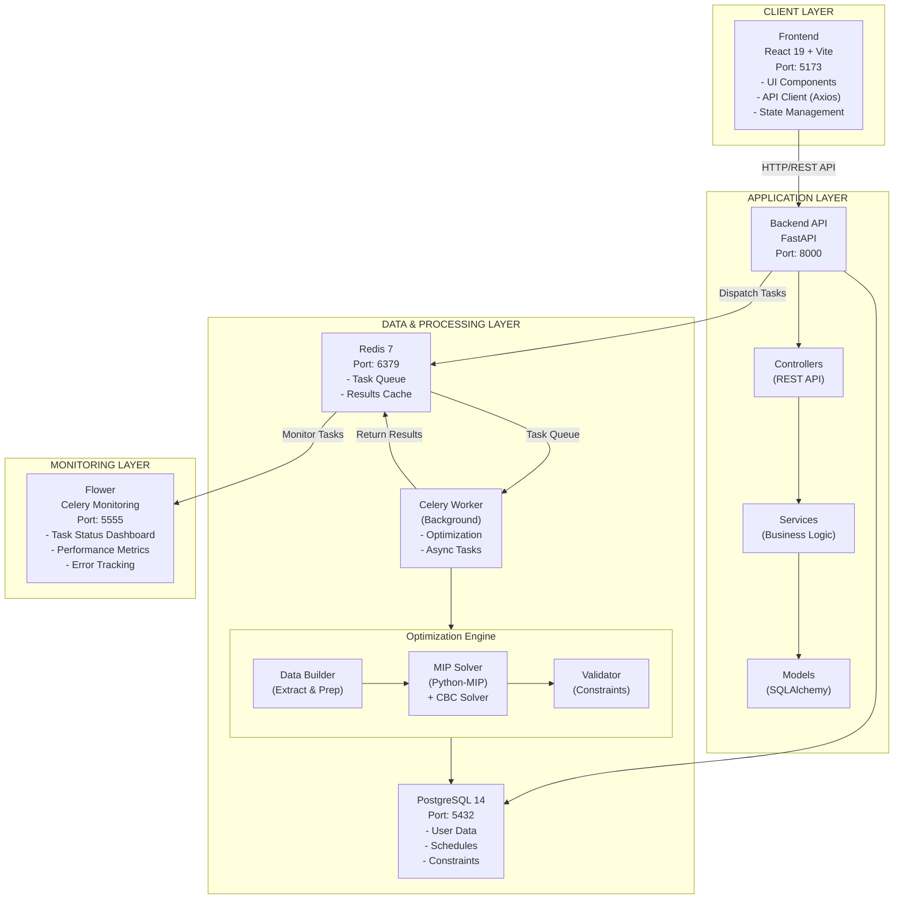
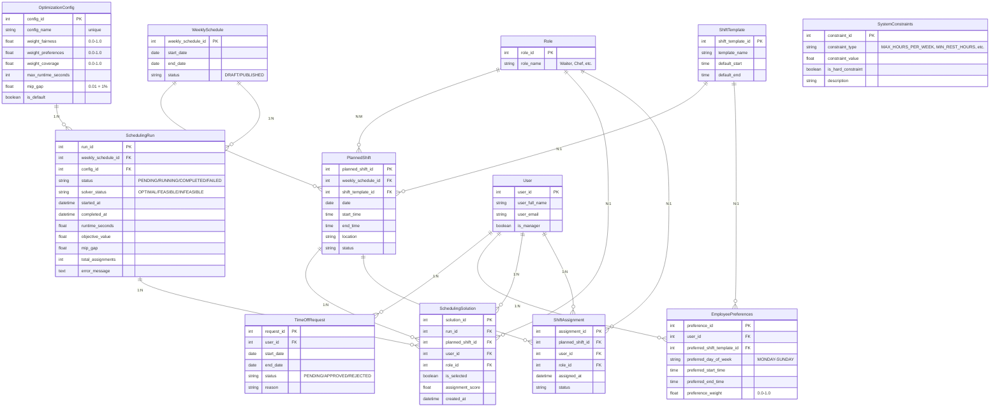
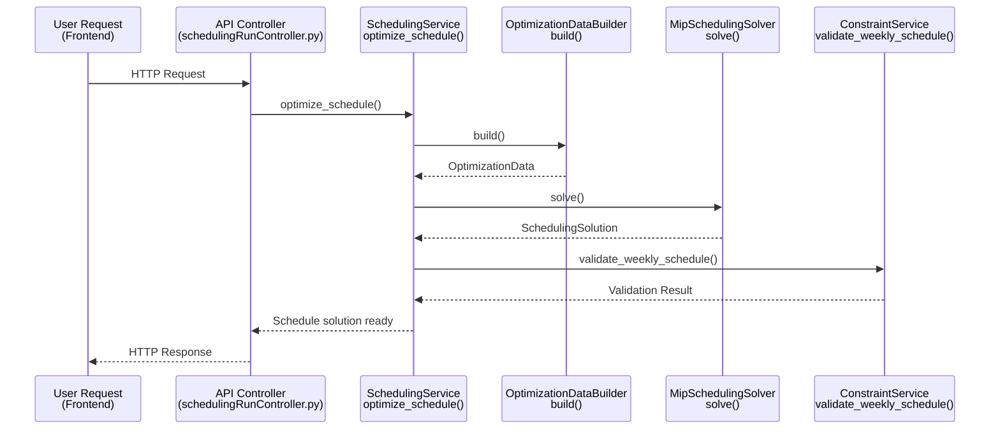
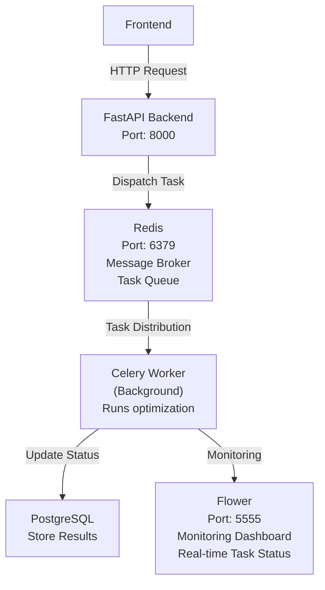
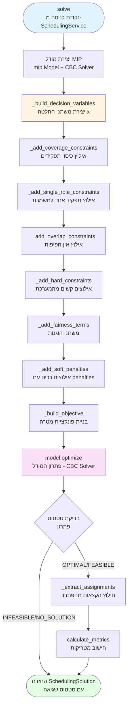

# Smart Scheduling - מערכת אופטימיזציה של משמרות עובדים עם MIP

מערכת אוטומטית ליצירת לוחות זמנים שבועיים באמצעות **Mixed Integer Programming (MIP)**. המערכת מאזנת בין העדפות עובדים, זמינות, כיסוי תפקידים והוגנות בעומס עבודה.

---

## 📑 תוכן עניינים

- [1. מטרות הפרויקט](#1-מטרות-הפרויקט)
- [2. טכנולוגיות מרכזיות](#2-טכנולוגיות-מרכזיות)
- [3. ארכיטקטורת המערכת](#3-ארכיטקטורת-המערכת)
- [4. עיבוד רקע: Celery, Redis ו-Flower](#4-עיבוד-רקע-celery-redis-ו-flower)
- [5. SchedulingService - Orchestrator ראשי](#5-schedulingservice---orchestrator-ראשי)
- [6. בניית מודל האופטימיזציה - OptimizationDataBuilder](#6-בניית-מודל-האופטימיזציה---optimizationdatabuilder)
- [7. מודל MIP: משתני החלטה, אילוצים ופונקציית מטרה](#7-מודל-mip-משתני-החלטה-אילוצים-ופונקציית-מטרה)
  - [7.1 משתני החלטה](#71-משתני-החלטה)
  - [7.2 אילוצים קשים](#72-אילוצים-קשים)
  - [7.3 אילוצים רכים](#73-אילוצים-רכים)
  - [7.4 פונקציית מטרה](#74-פונקציית-מטרה)
- [סיכום](#סיכום)

---

# 1️⃣ מטרות הפרויקט

## 🎯 הבעיה שהמערכת פותרת

- **📋 ניהול ידני מורכב**: יצירת לוח זמנים שבועי עם עשרות עובדים, משמרות ותפקידים דורש שעות עבודה
- **⚖️ קונפליקטים ואי-הוגנות**: קושי לאזן בין העדפות עובדים, זמינות, כיסוי תפקידים והוגנות בעומס עבודה
- **🔒 אילוצים מורכבים**: שעות מנוחה מינימליות, מקסימום שעות שבועי, חפיפות משמרות, חופשות מאושרות

## 👥 למי מיועדת המערכת

- **👔 מנהלי משמרות** (Shift Supervisors)
- **🏢 מחלקות משאבי אנוש** המנהלות לוחות זמנים שבועיים
- **👤 עובדים** המבקשים לראות את המשמרות שלהם ולעדכן העדפות

## ✅ מדדי הצלחה

- **⚖️ הוגנות**: חלוקה מאוזנת של משמרות בין עובדים (מינימום סטייה מהממוצע)
- **✅ כיסוי מלא**: כל משמרת מקבלת את כל התפקידים הנדרשים (Coverage = 100%)
- **😊 העדפות עובדים**: מקסימום שביעות רצון מהתאמה להעדפות (preference scores)
- **⚡ הפחתת עבודה ידנית**: מ-4-6 שעות ליצירת לוח זמנים שבועי → דקות ספורות
- **🎯 איכות פתרון**: פתרון אופטימלי או קרוב לאופטימלי (MIP gap < 1%)

---

# 2️⃣ טכנולוגיות מרכזיות

## 🔧 Backend

| טכנולוגיה         | תיאור                                            |
| ----------------- | ------------------------------------------------ |
| **FastAPI**       | Framework מודרני ל-API עם OpenAPI docs אוטומטיים |
| **PostgreSQL 14** | מסד נתונים יחסי                                  |
| **SQLAlchemy**    | ORM לניהול מודלים (15 מודלים)                    |
| **Celery 5.3+**   | עיבוד רקע אסינכרוני                              |
| **Redis 7**       | Message broker עבור Celery                       |

## 🎨 Frontend

| טכנולוגיה    | תיאור               |
| ------------ | ------------------- |
| **React 19** | UI framework מודרני |

## ⚙️ Optimization Engine

| טכנולוגיה                | תיאור                                         |
| ------------------------ | --------------------------------------------- |
| **Python-MIP >= 1.15.0** | ספריית MIP                                    |
| **CBC Solver**           | פתרון MIP open-source (bundled עם Python-MIP) |

## 🐳 Deployment

| טכנולוגיה          | תיאור                      |
| ------------------ | -------------------------- |
| **Docker**         | קונטיינריזציה              |
| **Docker Compose** | אורכיסטרציה של כל השירותים |

**שירותים ב-Docker Compose:**

- `db` (PostgreSQL)
- `backend` (FastAPI)
- `frontend` (React/Vite)
- `redis` (Celery broker)
- `celery-worker` (background tasks)
- `flower` (Celery monitoring)

---

# 3️⃣ ארכיטקטורת המערכת

## 🏗️ High-Level Architecture Diagram



## 🗄️ Infrastructure Components

| רכיב                    | טכנולוגיה        | פורט | תפקיד                    |
| ----------------------- | ---------------- | ---- | ------------------------ |
| **Frontend**            | React 19, Vite   | 5173 | ממשק משתמש               |
| **Backend API**         | FastAPI          | 8000 | REST API, Business Logic |
| **Database**            | PostgreSQL 14    | 5432 | אחסון נתונים             |
| **Message Broker**      | Redis 7          | 6379 | תור משימות Celery        |
| **Background Worker**   | Celery 5.3+      | -    | עיבוד אופטימיזציה        |
| **Monitoring**          | Flower           | 5555 | ניטור משימות Celery      |
| **Optimization Solver** | Python-MIP + CBC | -    | פתרון MIP                |

## 📊 דיאגרמת יישויות (Entity Relationship Diagram)

#### ישויות מורכבות - אופטימיזציה



**הסבר על ישויות מורכבות:**

1. **SchedulingRun** - רשומה אחת לכל ריצת אופטימיזציה. מכילה:

   - סטטוס הריצה (PENDING → RUNNING → COMPLETED)
   - תוצאות הפותר (objective_value, mip_gap)
   - קישור ל-WeeklySchedule ול-OptimizationConfig

2. **SchedulingSolution** - כל רשומה מייצגת הקצאה מוצעת מהפותר:

   - קשורה ל-SchedulingRun (N:1)
   - מכילה את השלישייה: (user_id, planned_shift_id, role_id)
   - `is_selected` מציין אם הפתרון נבחר

3. **OptimizationConfig** - הגדרות אופטימיזציה:

   - משקלים לפונקציית המטרה (fairness, preferences, coverage)
   - פרמטרים של הפותר (max_runtime, mip_gap)

4. **SystemConstraints** - אילוצי מערכת:

   - כל אילוץ מוגדר כ-hard או soft
   - דוגמאות: MAX_HOURS_PER_WEEK, MIN_REST_HOURS

5. **TimeOffRequest** - משפיע על מטריצת הזמינות:

   - רק בקשות מאושרות (APPROVED) משפיעות על האופטימיזציה

6. **EmployeePreferences** - משפיע על מטריצת העדפות:
   - משמש לחישוב `preference_scores[i, j]`

---

## 📦 מודולים מרכזיים

#### 1. **SchedulingService**

- **תפקיד**: Orchestrator ראשי של תהליך האופטימיזציה
- **זרימה**: `_execute_optimization_for_run()` → `_execute_run()` → `_build_and_solve()` → `_validate_solution()`
- **אחריות**: ניהול SchedulingRun records, טיפול בשגיאות, validation

#### 2. **OptimizationDataBuilder**

- **תפקיד**: הכנת נתונים למודל MIP
- **פונקציה עיקרית**: `build()` - איסוף נתונים מ-DB והכנה למודל MIP
- **תוצר**: בניית מטריצות זמינות והעדפות, mapping של אינדקסים

#### 3. **MipSchedulingSolver** (`app/services/scheduling/mip_solver.py`)

- **תפקיד**: בניית ופתרון מודל MIP
- **פונקציה עיקרית**: `solve()` - בניית מודל MIP ופתרון
- **תוצר**: משתני החלטה, אילוצים, פונקציית מטרה

#### 4. **ConstraintService** (`app/services/constraintService.py`)

- **תפקיד**: בדיקת תקינות הפתרון
- **פונקציה עיקרית**: `validate_weekly_schedule()` - בדיקת הפתרון נגד אילוצים קשים
- **בדיקות**: חפיפות, חופשות, שעות מנוחה, מקסימום שעות

## 🔄 זרימת נתונים (End-to-End)



---

# 4️⃣ עיבוד רקע: Celery, Redis ו-Flower

## 🎯 למה עיבוד רקע?

תהליך האופטימיזציה של לוח זמנים שבועי יכול לקחת **דקות** (תלוי בגודל הבעיה). ביצוע התהליך באופן סינכרוני יגרום ל:

- ⏱️ **Timeout של בקשות HTTP** (בדרך כלל 30-60 שניות)
- 🔒 **חסימת Thread** של FastAPI
- 😞 **חווית משתמש גרועה** - המשתמש מחכה ללא משוב

**הפתרון**: עיבוד אסינכרוני עם **Celery** ו-**Redis**.

## 🏗️ ארכיטקטורה



**הסבר על זרימת העבודה:**

1. **Frontend → Backend**: המשתמש שולח בקשה HTTP
2. **Backend → Redis**:
   - יוצר `SchedulingRun` עם סטטוס `PENDING`
   - שולח משימת Celery ל-Redis
   - מחזיר `task_id` מיד למשתמש (לא מחכה לסיום)
3. **Redis → Celery Worker**: Celery Worker קורא את המשימה מהתור
4. **Celery Worker → PostgreSQL**: מעדכן את הסטטוס ל-`RUNNING`, ואז ל-`COMPLETED` עם התוצאות
5. **Celery Worker → Flower**: Flower מציג את הסטטוס בזמן אמת

## 🔧 רכיבים

#### **Redis** - Message Broker

- **תפקיד**: תור הודעות (Message Queue) בין FastAPI ל-Celery Worker
- **שימוש**:
  - FastAPI שולח משימות ל-Redis
  - Celery Worker קורא משימות מ-Redis
  - Redis שומר תוצאות זמניות
- **פורט**: `6379`

#### **Celery Worker** - עיבוד רקע

- **תפקיד**: ביצוע משימות אופטימיזציה ברקע
- **תהליך**:
  1. קורא משימות מ-Redis
  2. קורא ל-`SchedulingService._execute_optimization_for_run()` (ראה [פרק 5](#5-schedulingservice---orchestrator-ראשי))
  3. מחזיר תוצאה ל-Redis

#### **Flower** - ניטור ומעקב

- **תפקיד**: Dashboard לניטור משימות Celery בזמן אמת
- **יכולות**:
  - 📊 צפייה במשימות פעילות, ממתינות, מושלמות
  - ⏱️ זמני ביצוע וסטטיסטיקות
  - 🔍 מעקב אחר שגיאות
  - 📈 גרפים ומטריקות
- **גישה**: `http://localhost:5555`

### 🔄 זרימת עבודה

```python
# 1. Frontend שולח בקשה
POST /api/scheduling/optimize?weekly_schedule_id=123

# 2. Backend יוצר רשומה ומשלח משימה
run = SchedulingRunModel(status=PENDING)
db.add(run)
db.commit()

task = run_optimization_task.delay(run.run_id)
return {"run_id": run.run_id, "task_id": task.id}

# 3. Celery Worker מבצע ברקע
@celery_app.task
def run_optimization_task(run_id):
    scheduling_service._execute_optimization_for_run(run)
    return results

# 4. Frontend בודק סטטוס (Polling)
GET /api/scheduling/runs/{run_id}
→ {"status": "COMPLETED", "objective_value": 123.45, ...}
```

[📄 קובץ מקור: `optimization_tasks.py`](backend/app/tasks/optimization_tasks.py#L17-L30)

## ✅ יתרונות

- ⚡ **תגובה מהירה**: API מחזיר מיד (לא מחכה לסיום האופטימיזציה)
- 🔄 **Scalability**: ניתן להוסיף מספר Celery Workers
- 📊 **ניטור**: Flower מספק visibility מלא
- 🛡️ **Resilience**: משימות נשמרות ב-Redis גם אם Worker נופל
- ⏱️ **Timeout Management**: הגבלת זמן אוטומטית למשימות ארוכות

---

# 5️⃣ SchedulingService - Orchestrator ראשי

## 🔨 תפקיד SchedulingService

המודול `SchedulingService` הוא ה-**Orchestrator הראשי** של תהליך האופטימיזציה. הוא מנהל את כל התהליך מקצה לקצה, כולל אינטגרציה עם DB, validation ו-persistence.

**אחריות מרכזית:**

- **ניהול SchedulingRun records** - יצירה, עדכון סטטוס, טיפול בשגיאות
- **אורכיסטרציה של תהליך האופטימיזציה** - קישור בין כל הרכיבים
- **טיפול בשגיאות** - עדכון סטטוס ל-FAILED עם הודעות שגיאה
- **Validation** - בדיקת תקינות הפתרון נגד אילוצים קשים לפני שמירה
- **Persistence** - שמירת תוצאות ב-DB (SchedulingSolution records)

## 📋 פונקציות מרכזיות

#### 1. **`_execute_optimization_for_run()`**

- **תפקיד**: נקודת הכניסה הראשית - מקבלת `SchedulingRun` record קיים
- **תהליך**: קורא ל-`_execute_run()` עם `apply_assignments=False`
- **הערה**: לא מיישם הקצאות ישירות, רק שומר פתרונות מוצעים ב-`SchedulingSolution` records
- **פלט**: `(SchedulingRunModel, SchedulingSolution)`

[📄 קובץ מקור: `scheduling_service.py`](backend/app/services/scheduling/scheduling_service.py#L119-L178)

#### 2. **`_execute_run()`**

- **תפקיד**: Executor משותף שמנהל את כל התהליך
- **תהליך**:
  1. `_start_run()` - עדכון סטטוס ל-`RUNNING` עם race condition protection
  2. `_load_optimization_config()` - טעינת הגדרות אופטימיזציה
  3. `_build_and_solve()` - בניית נתונים ופתרון מודל MIP
  4. בדיקת סטטוס פתרון (INFEASIBLE → `_handle_infeasible_solution()`)
  5. `_validate_solution()` - בדיקת תקינות נגד אילוצים קשים
  6. `_persist_solution()` - שמירת תוצאות ב-DB

[📄 קובץ מקור: `scheduling_service.py`](backend/app/services/scheduling/scheduling_service.py#L180-L215)

```python
def _execute_run(
    self,
    run: SchedulingRunModel,
    apply_assignments: bool = True
) -> Tuple[SchedulingRunModel, SchedulingSolution]:
    """
    Shared executor for optimization runs.

    Args:
        run: SchedulingRunModel record
        apply_assignments: If True, create ShiftAssignmentModel records.
                          If False, only store solutions.

    Returns:
        Tuple of (updated run, solution)
    """
    # Update status to RUNNING with race condition protection
    run = self._start_run(run)

    # Load configuration
    config = self._load_optimization_config(run)

    # Build and solve
    solution = self._build_and_solve(run, config)

    # Check if optimization was infeasible or failed
    if solution.status in ['INFEASIBLE', 'NO_SOLUTION_FOUND']:
        return self._handle_infeasible_solution(run, solution)

    # Validate solution against HARD constraints BEFORE persisting
    if solution.status in ['OPTIMAL', 'FEASIBLE']:
        self._validate_solution(run, solution)

    # Persist solution and optionally apply assignments
    run = self._persist_solution(run, solution, apply_assignments)

    return run, solution
```

#### 3. **`_build_and_solve()`**

- **תפקיד**: קישור בין OptimizationDataBuilder ל-MipSchedulingSolver
- **תהליך**:
  1. קורא ל-`OptimizationDataBuilder.build()` - איסוף נתונים מ-DB
  2. קורא ל-`MipSchedulingSolver.solve()` - פתרון מודל MIP
- **פלט**: `SchedulingSolution`

[📄 קובץ מקור: `scheduling_service.py`](backend/app/services/scheduling/scheduling_service.py#L282-L306)

#### 4. **`_validate_solution()`**

- **תפקיד**: בדיקת תקינות הפתרון נגד אילוצים קשים
- **תהליך**: קורא ל-`ConstraintService.validate_weekly_schedule()`
- **בדיקות**: חפיפות, חופשות, שעות מנוחה, מקסימום שעות
- **הערה**: אם יש הפרות → מעלה `ValueError`

[📄 קובץ מקור: `scheduling_service.py`](backend/app/services/scheduling/scheduling_service.py#L338-L397)

#### 5. **`_persist_solution()`**

- **תפקיד**: שמירת תוצאות ב-DB
- **תהליך**: קורא ל-`SchedulingPersistence.save_solution()`
- **שמירה**:
  - עדכון `SchedulingRun` עם תוצאות
  - יצירת `SchedulingSolution` records
  - אופציונלי: יצירת `ShiftAssignment` records (אם `apply_assignments=True`)

[📄 קובץ מקור: `scheduling_service.py`](backend/app/services/scheduling/scheduling_service.py#L399-L468)

## 🔗 אינטגרציה עם רכיבים אחרים

`SchedulingService` משתמש ב-4 רכיבים עיקריים:

1. **`OptimizationDataBuilder`** - איסוף והכנת נתונים
2. **`MipSchedulingSolver`** - פתרון מודל MIP
3. **`ConstraintService`** - בדיקת תקינות
4. **`SchedulingPersistence`** - שמירה ב-DB

---

# 6️⃣ בניית מודל האופטימיזציה - OptimizationDataBuilder

## 🔨 תפקיד OptimizationDataBuilder

המודול `OptimizationDataBuilder` אחראי על איסוף והכנת כל הנתונים הנדרשים לבניית מודל MIP. הוא מתחבר ל-DB, אוסף נתונים, ומכין אותם בפורמט המתאים למודל MIP.

**אחריות מרכזית:**

- **איסוף נתונים מ-DB** - עובדים, משמרות, תפקידים, הקצאות קיימות, חופשות מאושרות
- **בניית מטריצות** - מטריצת זמינות ומטריצת העדפות (NumPy arrays)
- **מיפוי תפקידים** - קישור בין עובדים לתפקידים ובין משמרות לדרישות תפקידים
- **זיהוי קונפליקטים** - חפיפות משמרות, חופשות, שעות מנוחה
- **אילוצי מערכת** - איסוף והכנת אילוצים קשים ורכים
- **בניית אינדקסים** - מיפוי בין IDs לאינדקסים במטריצות

## 📋 פונקציות מרכזיות

#### 1. **`build()`**

- **תפקיד**: Orchestrator ראשי - מכין את כל הנתונים הנדרשים למודל MIP
- **תהליך**:
  1. אימות קיום WeeklySchedule
  2. איסוף נתונים בסיסיים מ-DB (עובדים, משמרות, תפקידים)
  3. בניית אינדקסים (employee_index, shift_index)
  4. מיפוי תפקידים (role_requirements, employee_roles)
  5. בניית הקצאות קיימות
  6. בניית מטריצות (availability_matrix, preference_scores)
  7. בניית אילוצים וקונפליקטים
- **פלט**: `OptimizationData` - אובייקט עם כל הנתונים המוכנים

[📄 קובץ מקור: `optimization_data_builder.py`](backend/app/services/optimization_data_services/optimization_data_builder.py#L52-L96)

```python
def build(self, weekly_schedule_id: int) -> OptimizationData:
    """
    Main orchestrator method to prepare all optimization data.

    This method coordinates all data extraction and transformation steps
    to build a complete OptimizationData object.

    Args:
        weekly_schedule_id: ID of the weekly schedule to optimize

    Returns:
        OptimizationData object with all required data structures
    """
    data = OptimizationData()

    # Verify weekly schedule exists
    self._verify_weekly_schedule(weekly_schedule_id)

    # Extract base data from database
    data.employees, data.shifts, data.roles = self._extract_base_data(weekly_schedule_id)

    # Build index mappings
    data.employee_index, data.shift_index = self._build_indices(data.employees, data.shifts)

    # Build role mappings
    data.role_requirements = self.build_role_requirements(data.shifts)
    data.employee_roles = self.build_employee_roles(data.employees)

    # Build existing assignments (for preserving preferred assignments)
    data.existing_assignments = self.build_existing_assignments(weekly_schedule_id)

    # Build matrices and constraints
    time_off_map = self._build_time_off_map_for_schedule(data.shifts)
    data.availability_matrix, data.preference_scores = self._build_matrices(
        data.employees, data.shifts, data.employee_index, data.shift_index,
        data.existing_assignments, time_off_map
    )

    # Build constraints and conflicts
    data.shift_overlaps, data.shift_durations, data.system_constraints, \
    data.time_off_conflicts, data.shift_rest_conflicts = self._build_constraints_and_conflicts(
        data.employees, data.shifts, data.shift_index, time_off_map
    )

    return data
```

#### 2. **`build_role_requirements()` ו-`build_employee_roles()` - מיפוי תפקידים**

- **תפקיד**: בונה מיפוי בין משמרות לתפקידים נדרשים ובין עובדים לתפקידים שלהם
- **תוצר**:
- **`role_requirements`**: `{shift_id: [role_id, ...]}` - אילו תפקידים נדרשים לכל משמרת
- **`employee_roles`**: `{user_id: [role_id, ...]}` - אילו תפקידים יש לכל עובד

[📄 קובץ מקור: `optimization_data_builder.py`](backend/app/services/optimization_data_services/optimization_data_builder.py#L388-L422)

#### 3. **`build_existing_assignments()` - הקצאות קיימות**

- **תפקיד**: אוסף הקצאות קיימות מהמסד נתונים
- **תוצר**: **`existing_assignments`**: `{(employee_id, shift_id, role_id)}` - הקצאות שנשמרו
- **שימוש**: משמש לבניית מטריצת הזמינות (הקצאות קיימות לא זמינות להקצאה מחדש)

[📄 קובץ מקור: `optimization_data_builder.py`](backend/app/services/optimization_data_services/optimization_data_builder.py#L423-L461)

#### 4. **`_build_matrices()` - בניית מטריצות**

- **תפקיד**: בונה את מטריצת הזמינות ומטריצת העדפות
- **תוצר**:
- **`availability_matrix`**: `np.ndarray(employees × shifts)` - 1=זמין, 0=לא זמין
- **`preference_scores`**: `np.ndarray(employees × shifts)` - ציון העדפה 0.0-1.0

**מטריצת הזמינות** (`availability_matrix[i, j]`) קובעת אם עובד `i` זמין למשמרת `j`:

- **אתחול**: כל הערכים מתחילים כ-`1` (זמין)
- **Time Off מאושר** → `availability[i, j] = 0` (אם לעובד יש time off מאושר בתאריך המשמרת)
- **הקצאה קיימת** → `availability[i, j] = 0` (אם העובד כבר משובץ למשמרת זו)
- **חפיפה עם משמרת אחרת** → `availability[i, j] = 0` (אם העובד כבר משובץ למשמרת חופפת)
- **אין תפקיד מתאים** → `availability[i, j] = 0` (אם לעובד אין אף תפקיד שמתאים לדרישות המשמרת)

[📄 קובץ מקור: `optimization_data_builder.py`](backend/app/services/optimization_data_services/optimization_data_builder.py#L162-L194)

#### 5. **`_build_constraints_and_conflicts()` - זיהוי קונפליקטים**

- **תפקיד**: מזהה קונפליקטים ואילוצים בין משמרות ועובדים
- **תוצר**:
  - **`shift_overlaps`**: `{shift_id: [overlapping_shift_ids]}` - משמרות חופפות
  - **`time_off_conflicts`**: `{emp_id: [conflicting_shift_ids]}` - עובדים עם חופשות מאושרות
  - **`shift_rest_conflicts`**: `{shift_id: {conflicting_shift_ids}}` - משמרות שלא מספקות שעות מנוחה מינימליות
  - **`system_constraints`**: `{SystemConstraintType: (value, is_hard)}` - אילוצי מערכת
  - **`shift_durations`**: `{shift_id: duration_hours}` - משך משמרות

[📄 קובץ מקור: `optimization_data_builder.py`](backend/app/services/optimization_data_services/optimization_data_builder.py#L215-L258)

---

# 7️⃣ מודל MIP: משתני החלטה, אילוצים ופונקציית מטרה

## 🔨 תפקיד MipSchedulingSolver

המודול `MipSchedulingSolver` אחראי על בניית ופתרון מודל **Mixed Integer Programming (MIP)** לאופטימיזציה של הקצאות משמרות. המודל מקבל את הנתונים המוכנים מ-`OptimizationDataBuilder` ובונה מודל מתמטי הכולל:

- **משתני החלטה בינאריים** `x(i,j,r)` - מייצגים הקצאה של עובד `i` למשמרת `j` בתפקיד `r`
- **אילוצים קשים** - חובה לספק (כיסוי, חפיפות, מנוחה מינימלית, וכו')
- **אילוצים רכים** - רצוי לספק עם עונשים (שעות מינימום/מקסימום, משמרות, וכו')
- **פונקציית מטרה** - משלבת העדפות עובדים, הוגנות, כיסוי ועונשים

## 🔄 זרימת עבודה - בניית ופתרון מודל MIP



**הסבר קצר על הזרימה:**

1. **`solve()`** - נקודת הכניסה מ-`SchedulingService._build_and_solve()`:

   - מקבל `OptimizationData` (נתונים מוכנים) ו-`OptimizationConfig` (הגדרות)
   - יוצר מודל MIP עם CBC Solver

2. **בניית משתני החלטה** (`_build_decision_variables`):

   - יוצר משתנים בינאריים `x(i,j,r)` לכל צירוף תקף

3. **הוספת אילוצים קשים**:

   - `_add_coverage_constraints` - כיסוי תפקידים
   - `_add_single_role_constraints` - תפקיד אחד למשמרת
   - `_add_overlap_constraints` - אין חפיפות
   - `_add_hard_constraints` - אילוצי מערכת קשים

4. **הוספת אילוצים רכים והוגנות**:

   - `_add_fairness_terms` - משתני הוגנות (deviation_pos, deviation_neg)
   - `_add_soft_penalties` - אילוצים רכים עם penalties

5. **בניית פונקציית מטרה** (`_build_objective`):

   - משלבת העדפות, הוגנות, כיסוי ועונשים
   - מגדיר `model.objective`

6. **פתרון המודל** (`model.optimize()`):

   - CBC Solver מחפש פתרון אופטימלי
   - מחזיר סטטוס: OPTIMAL, FEASIBLE, INFEASIBLE, או NO_SOLUTION_FOUND

7. **חילוץ תוצאות**:
   - `_extract_assignments` - המרת משתנים לקצאות בפועל
   - `calculate_metrics` - חישוב מטריקות (כיסוי, הוגנות, וכו')

[📄 קובץ מקור: `mip_solver.py`](backend/app/services/scheduling/mip_solver.py#L28-L101)

---

## 7.1 משתני החלטה

#### 📐 הגדרה מתמטית

```
x(i,j,r) ∈ {0,1}  - משתנה בינארי

כאשר:
  i = אינדקס עובד (0..n_employees-1)
  j = אינדקס משמרת (0..n_shifts-1)
  r = role_id (תפקיד: Waiter, Bartender, Chef, וכו')

x(i,j,r) = 1  אם עובד i מוקצה למשמרת j בתפקיד r
x(i,j,r) = 0  אחרת
```

#### 💡 אינטואיציה

כל משתנה מייצג החלטה: **"האם להקצות עובד X למשמרת Y בתפקיד Z?"**

**משתנים נוצרים רק עבור צירופים תקפים:**

- ✅ עובד זמין למשמרת (`availability_matrix[i,j] == 1`)
  - **כולל בדיקה של time off מאושר**: אם לעובד יש time off מאושר בתאריך המשמרת, `availability_matrix[i,j] = 0` → לא נוצר משתנה
- ✅ עובד בעל התפקיד הנדרש (`role_id in employee_roles[user_id]`)
- ✅ משמרת דורשת את התפקיד (`role_id in shift['required_roles']`)

#### 💻 קוד - יצירת משתנים

```python
def _build_decision_variables(model, data, n_employees, n_shifts):
    x = {}  # {(emp_idx, shift_idx, role_id): var}
    vars_by_emp_shift = {}  # {(emp_idx, shift_idx): [var1, var2, ...]} - for performance
    vars_by_employee = {}  # {emp_idx: [var1, var2, ...]} - for O(1) access

    for emp_idx, emp in enumerate(data.employees):
        for shift_idx, shift in enumerate(data.shifts):
            if data.availability_matrix[emp_idx, shift_idx] != 1:
                continue  # Skip if employee not available

            required_roles = shift.get('required_roles') or []
            if not required_roles:
                continue

            emp_role_ids = set(emp.get('roles') or [])

            # Create variable for each role that employee has AND shift requires
            for role_req in required_roles:
                role_id = role_req['role_id']
                if role_id in emp_role_ids:
                    var = model.add_var(var_type=mip.BINARY, name=f'x_{emp_idx}_{shift_idx}_{role_id}')
                    x[emp_idx, shift_idx, role_id] = var

                    # Build indexes for performance
                    if (emp_idx, shift_idx) not in vars_by_emp_shift:
                        vars_by_emp_shift[(emp_idx, shift_idx)] = []
                    vars_by_emp_shift[(emp_idx, shift_idx)].append(var)

                    # Build employee index for O(1) access
                    if emp_idx not in vars_by_employee:
                        vars_by_employee[emp_idx] = []
                    vars_by_employee[emp_idx].append(var)

    return x, vars_by_emp_shift, vars_by_employee
```

[📄 קובץ מקור: `mip_solver.py`](backend/app/services/scheduling/mip_solver.py#L103-L151)


---

## 7.2 אילוצים קשים

#### 7.2.1 אילוצים קשים שלא חלק מ-`system_constraints`

אלה אילוצים **תמיד קשים** שמובנים במערכת ולא ניתן לשנות אותם דרך ה-UI.

---

#### ✅ Coverage Constraint (כיסוי תפקידים)

**אינטואיציה**: כל משמרת חייבת לקבל בדיוק את מספר העובדים הנדרש לכל תפקיד

**נוסחה**:

```
Σ_i x(i,j,r) = required_count[j,r]  לכל j, r
```

**משתנים**:

- `x(i,j,r)`: משתני החלטה בינאריים (0 או 1)
- `i`: אינדקס עובד (0..n_employees-1)
- `j`: אינדקס משמרת (0..n_shifts-1)
- `r`: role_id (תפקיד)

**תנאים**:

- משתנה `x(i,j,r)` נוצר רק אם:
  - `availability_matrix[i, j] == 1` (עובד זמין)
  - `role_id in employee_roles[user_id]` (עובד בעל התפקיד)
  - `role_id in shift['required_roles']` (משמרת דורשת את התפקיד)

**דוגמה**:

- משמרת 101 דורשת 2 Waiters (role_id=1) ו-1 Chef (role_id=3)
- עובדים זמינים: John (idx=0, roles=[1,2]), Jane (idx=1, roles=[3]), Bob (idx=2, roles=[1])
- **אילוצים שנוצרים**:
  - `x(0,0,1) + x(2,0,1) == 2` (2 Waiters)
  - `x(1,0,3) == 1` (1 Chef)
- **פתרון אפשרי**: `x(0,0,1)=1, x(2,0,1)=1, x(1,0,3)=1` (כל השאר = 0)

```python
def _add_coverage_constraints(model, data, x, n_employees, n_shifts):
    for shift_idx, shift in enumerate(data.shifts):
        required_roles = shift.get('required_roles') or []
        if not required_roles:
            continue

        for role_req in required_roles:
            role_id = role_req['role_id']
            required_count = int(role_req['required_count'])

            eligible_vars = [x[emp_idx, shift_idx, role_id] for emp_idx in range(n_employees)
                           if (emp_idx, shift_idx, role_id) in x]

            if not eligible_vars:
                if required_count > 0:
                    raise ValueError(f"Infeasible coverage: shift {shift['planned_shift_id']} "
                                   f"requires role {role_id} count={required_count}, "
                                   f"but no eligible employees exist")
                continue

            model += mip.xsum(eligible_vars) == required_count
```

[📄 קובץ מקור: `mip_solver.py`](backend/app/services/scheduling/mip_solver.py#L261-L290)

---

#### 🔒 Single Role Per Shift (תפקיד אחד למשמרת)

**אינטואיציה**: עובד לא יכול להיות מוקצה ליותר מתפקיד אחד באותה משמרת

**נוסחה**:

```
Σ_r x(i,j,r) ≤ 1  לכל i, j
```

**משתנים**:

- `x(i,j,r)`: משתני החלטה בינאריים לכל תפקיד `r` שהעובד `i` יכול למלא במשמרת `j`

**תנאים**:

- אילוץ נוצר רק אם לעובד יש יותר מתפקיד אחד שהוא יכול למלא במשמרת זו
- כלומר: `len(vars_by_emp_shift[(emp_idx, shift_idx)]) > 1`

**דוגמה**:

- John (idx=0) יכול להיות Waiter (role_id=1) או Bartender (role_id=2) במשמרת 102
- **אילוץ שנוצר**: `x(0,1,1) + x(0,1,2) <= 1`
- **פתרון אפשרי**:
  - `x(0,1,1)=1, x(0,1,2)=0` (John הוא Waiter)
  - `x(0,1,1)=0, x(0,1,2)=1` (John הוא Bartender)
  - `x(0,1,1)=0, x(0,1,2)=0` (John לא משובץ למשמרת זו)
  - ❌ **לא אפשרי**: `x(0,1,1)=1, x(0,1,2)=1` (John לא יכול להיות גם Waiter וגם Bartender)

```python
def _add_single_role_constraints(model, x, vars_by_emp_shift, n_employees, n_shifts):
    for emp_idx in range(n_employees):
        for shift_idx in range(n_shifts):
            if (emp_idx, shift_idx) in vars_by_emp_shift:
                role_vars = vars_by_emp_shift[(emp_idx, shift_idx)]
                if len(role_vars) > 1:
                    model += mip.xsum(role_vars) <= 1
```

[📄 קובץ מקור: `mip_solver.py`](backend/app/services/scheduling/mip_solver.py#L292-L315)

---

#### ⚠️ No Overlapping Shifts (אין משמרות חופפות)

**אינטואיציה**: עובד לא יכול להיות מוקצה למשמרות חופפות בזמן

**נוסחה**:

```
Σ_r x(i,j1,r) + Σ_r x(i,j2,r) ≤ 1  לכל i, (j1,j2) חופפים
```

**משתנים**:

- `x(i,j1,r)`: משתני החלטה למשמרת `j1`
- `x(i,j2,r)`: משתני החלטה למשמרת `j2` החופפת

**תנאים**:

- משמרות `j1` ו-`j2` חופפות בזמן (overlap detection)
- לעובד `i` יש משתנים זמינים בשתי המשמרות

**דוגמה**:

- משמרת 101: 09:00-17:00 (shift_idx=0)
- משמרת 102: 13:00-22:00 (shift_idx=1) - חופפת עם 101
- John (idx=0) יכול להיות Waiter בשתי המשמרות
- **אילוץ שנוצר**: `x(0,0,1) + x(0,1,1) <= 1`
- **פתרון אפשרי**:
  - `x(0,0,1)=1, x(0,1,1)=0` (John במשמרת 101 בלבד)
  - `x(0,0,1)=0, x(0,1,1)=1` (John במשמרת 102 בלבד)
  - `x(0,0,1)=0, x(0,1,1)=0` (John לא משובץ לאף אחת)
  - ❌ **לא אפשרי**: `x(0,0,1)=1, x(0,1,1)=1` (John לא יכול להיות בשתי המשמרות החופפות)

```python
def _add_overlap_constraints(model, data, x, vars_by_emp_shift, n_employees):
    for shift_id, overlapping_ids in data.shift_overlaps.items():
        if not overlapping_ids:
            continue

        shift_idx = data.shift_index[shift_id]
        for overlapping_id in overlapping_ids:
            overlapping_idx = data.shift_index[overlapping_id]

            for emp_idx in range(n_employees):
                vars_shift = vars_by_emp_shift.get((emp_idx, shift_idx), [])
                vars_overlap = vars_by_emp_shift.get((emp_idx, overlapping_idx), [])

                if vars_shift and vars_overlap:
                    model += mip.xsum(vars_shift) + mip.xsum(vars_overlap) <= 1
```

[📄 קובץ מקור: `mip_solver.py`](backend/app/services/scheduling/mip_solver.py#L317-L350)

---

#### 🏖️ Time Off מאושר (Approved Time Off)

**אינטואיציה**: עובד עם time off מאושר לא יכול להיות משובץ למשמרות בתאריכי החופשה שלו

**איך זה מטופל**: **לא דרך אילוץ מפורש**, אלא דרך **מטריצת הזמינות** (ראה [פרק 6 - מטריצת הזמינות](#6-בניית-מודל-האופטימיזציה---optimizationdatabuilder))

- אם לעובד יש time off מאושר בתאריך המשמרת, `availability_matrix[i, j] = 0`
- ב-`_build_decision_variables()`, אם `availability_matrix[i, j] != 1`, לא נוצר משתנה `x[i, j, role_id]`
- **ללא משתנה = לא ניתן להקצות**: הפתרון לא יכול להקצות עובד למשמרת אם אין משתנה עבורו

> **💡 למה זה יעיל יותר מאילוץ מפורש?**
>
> - ✅ פחות משתנים = מודל קטן יותר = פתרון מהיר יותר
> - ✅ אין צורך להוסיף אילוצים נוספים למודל
> - ✅ הגישה מבטיחה 100% שלא ניתן להקצות עובד ב-time off (כי אין משתנה)

#### 7.2.2 אילוצים שהם חלק מ-`system_constraints` (קשים)

אלה אילוצים שניתן להגדיר דרך ה-UI כ**קשים** (hard) או **רכים** (soft), בהתאם ל-`is_hard_constraint`. כאן מוצגים כאשר הם מוגדרים כקשים.

---

#### ⏰ Minimum Rest Hours (MIN_REST_HOURS)

**אינטואיציה**: עובד חייב לקבל שעות מנוחה מינימליות בין משמרות

**נוסחה**:

```
Σ_r x(i,j1,r) + Σ_r x(i,j2,r) ≤ 1  לכל i, (j1,j2) עם מנוחה לא מספקת
```

**משתנים**:

- `x(i,j1,r)`: משתני החלטה למשמרת `j1`
- `x(i,j2,r)`: משתני החלטה למשמרת `j2` שלא מספקת מנוחה מינימלית

**תנאים**:

- משמרות `j1` ו-`j2` נמצאות ב-`shift_rest_conflicts` (מנוחה < MIN_REST_HOURS)
- חישוב: `hours_between_shifts < MIN_REST_HOURS`
- אילוץ נוצר רק אם לעובד יש משתנים זמינים בשתי המשמרות

**דוגמה**:

- MIN_REST_HOURS = 11 שעות
- משמרת 101: 09:00-17:00 (יום א')
- משמרת 102: 06:00-14:00 (יום ב') - רק 13 שעות מנוחה (17:00 עד 06:00 למחרת)
- **חישוב**: 13 שעות < 11 שעות? ❌ לא, אז אין קונפליקט
- **דוגמה עם קונפליקט**:
  - משמרת 101: 09:00-17:00 (יום א')
  - משמרת 103: 04:00-12:00 (יום ב') - רק 11 שעות מנוחה
  - **אילוץ שנוצר**: `x(i,0,r) + x(i,2,r) <= 1` (לא ניתן להקצות את אותו עובד לשתי המשמרות)

```python
min_rest_constraint = data.system_constraints.get(SystemConstraintType.MIN_REST_HOURS)
if min_rest_constraint and min_rest_constraint[1]:  # is_hard
    for shift_id, conflicting_ids in data.shift_rest_conflicts.items():
        shift_idx = data.shift_index[shift_id]
        for conflicting_id in conflicting_ids:
            conflicting_idx = data.shift_index[conflicting_id]

            for emp_idx in range(n_employees):
                vars_shift = vars_by_emp_shift.get((emp_idx, shift_idx), [])
                vars_conflict = vars_by_emp_shift.get((emp_idx, conflicting_idx), [])

                if vars_shift and vars_conflict:
                    model += mip.xsum(vars_shift) + mip.xsum(vars_conflict) <= 1
```

[📄 קובץ מקור: `mip_solver.py`](backend/app/services/scheduling/mip_solver.py#L389-L407)

---

#### 📊 Max Shifts Per Week (MAX_SHIFTS_PER_WEEK)

**אינטואיציה**: עובד לא יכול לעבוד יותר מ-X משמרות בשבוע

**נוסחה**:

```
Σ_j Σ_r x(i,j,r) ≤ max_shifts  לכל i
```

**משתנים**:

- `x(i,j,r)`: כל משתני ההחלטה של עובד `i` לכל המשמרות `j` והתפקידים `r`

**תנאים**:

- אילוץ נוצר לכל עובד שיש לו לפחות משתנה אחד
- `max_shifts`: ערך מהגדרת `system_constraints`

**דוגמה**:

- MAX_SHIFTS_PER_WEEK = 5
- John (idx=0) יכול להיות משובץ למשמרות: 101, 102, 103, 104, 105, 106
- **אילוץ שנוצר**: `x(0,0,1) + x(0,0,2) + x(0,1,1) + x(0,1,2) + ... + x(0,5,1) <= 5`
- **פתרון אפשרי**:
  - John משובץ ל-5 משמרות: `Σ x(0,j,r) = 5` ✅
  - John משובץ ל-3 משמרות: `Σ x(0,j,r) = 3` ✅
  - ❌ **לא אפשרי**: `Σ x(0,j,r) = 6` (יותר מ-5 משמרות)

```python
max_shifts_constraint = data.system_constraints.get(SystemConstraintType.MAX_SHIFTS_PER_WEEK)
if max_shifts_constraint and max_shifts_constraint[1]:  # is_hard
    max_shifts = int(max_shifts_constraint[0])
    for emp_idx in range(n_employees):
        emp_vars = self._get_employee_vars(emp_idx, vars_by_employee)
        if emp_vars:
            model += mip.xsum(emp_vars) <= max_shifts
```

[📄 קובץ מקור: `mip_solver.py`](backend/app/services/scheduling/mip_solver.py#L369-L377)

---

#### ⏱️ Max Hours Per Week (MAX_HOURS_PER_WEEK)

**אינטואיציה**: עובד לא יכול לעבוד יותר מ-X שעות בשבוע

**נוסחה**:

```
Σ_j Σ_r x(i,j,r) * duration(j) ≤ max_hours  לכל i
```

**משתנים**:

- `x(i,j,r)`: משתני החלטה
- `duration(j)`: משך המשמרת `j` בשעות (מ-`shift_durations`)

**תנאים**:

- אילוץ נוצר לכל עובד שיש לו לפחות משתנה אחד
- `max_hours`: ערך מהגדרת `system_constraints`

**דוגמה**:

- MAX_HOURS_PER_WEEK = 40 שעות
- John (idx=0) משובץ למשמרות:
  - משמרת 101: 8 שעות → `x(0,0,1) * 8`
  - משמרת 102: 5 שעות → `x(0,1,1) * 5`
  - משמרת 103: 8 שעות → `x(0,2,1) * 8`
- **אילוץ שנוצר**: `8*x(0,0,1) + 5*x(0,1,1) + 8*x(0,2,1) + ... <= 40`
- **פתרון אפשרי**:
  - John עובד 8+5+8=21 שעות: `8*1 + 5*1 + 8*1 = 21 <= 40` ✅
  - John עובד 40 שעות בדיוק: `8*5 = 40 <= 40` ✅
  - ❌ **לא אפשרי**: `8*6 = 48 > 40` (יותר מ-40 שעות)

```python
max_hours_constraint = data.system_constraints.get(SystemConstraintType.MAX_HOURS_PER_WEEK)
if max_hours_constraint and max_hours_constraint[1]:  # is_hard
    max_hours = max_hours_constraint[0]
    for emp_idx in range(n_employees):
        emp_hours_vars = self._get_employee_hours_vars(emp_idx, vars_by_emp_shift, data)
        if emp_hours_vars:
            model += mip.xsum(emp_hours_vars) <= max_hours
```

[📄 קובץ מקור: `mip_solver.py`](backend/app/services/scheduling/mip_solver.py#L379-L387)

---

#### 📅 Max Consecutive Days (MAX_CONSECUTIVE_DAYS)

**אינטואיציה**: עובד לא יכול לעבוד יותר מ-X ימים רצופים

**נוסחה**:

```
עבור כל רצף של max_consecutive+1 ימים רצופים:
Σ_d works_on_day[i,d] ≤ max_consecutive
```

**מימוש**: משתמש במשתנים בינאריים `works_on_day[i, date]` שמסמנים אם עובד עובד ביום מסוים

**משתנים**:

- `works_on_day[i, date]`: משתנה בינארי שמסמן אם עובד `i` עובד ביום `date`
- `x(i,j,r)`: משתני החלטה המקושרים ל-`works_on_day` דרך אילוצים

**תנאים**:

- `works_on_day[i, date] = 1` אם `Σ_j Σ_r x(i,j,r) >= 1` (עובד עובד לפחות במשמרת אחת ביום זה)
- `works_on_day[i, date] <= Σ_j Σ_r x(i,j,r)` (אם עובד לא עובד, `works_on_day = 0`)

**דוגמה**:

- MAX_CONSECUTIVE_DAYS = 3
- ימים: יום א', ב', ג', ד', ה'
- **אילוצים שנוצרים** (לכל רצף של 4 ימים רצופים):
  - `works_on_day[i, Mon] + works_on_day[i, Tue] + works_on_day[i, Wed] + works_on_day[i, Thu] <= 3`
  - `works_on_day[i, Tue] + works_on_day[i, Wed] + works_on_day[i, Thu] + works_on_day[i, Fri] <= 3`
- **פתרון אפשרי**:
  - עובד עובד ב-א', ב', ג' (3 ימים רצופים): ✅
  - עובד עובד ב-א', ב', ג', ד' (4 ימים רצופים): ❌ **לא אפשרי**
  - עובד עובד ב-א', ב', ג', ה' (3 ימים, יום ד' חופש): ✅

```python
max_consecutive_constraint = data.system_constraints.get(SystemConstraintType.MAX_CONSECUTIVE_DAYS)
if max_consecutive_constraint and max_consecutive_constraint[1]:  # is_hard
    max_consecutive = int(max_consecutive_constraint[0])
    # Build works_on_day variables and add constraints for consecutive sequences
    date_to_shifts = self._build_date_to_shifts_mapping(data)
    works_on_day = self._build_works_on_day_variables(...)

    # For each sequence of (max_consecutive+1) consecutive days
    for sequence_dates in consecutive_sequences:
        for emp_idx in range(n_employees):
            day_vars = [works_on_day[(emp_idx, d)] for d in sequence_dates]
            model += mip.xsum(day_vars) <= max_consecutive
```

[📄 קובץ מקור: `mip_solver.py`](backend/app/services/scheduling/mip_solver.py#L409-L498)

---

#### ⏱️ Min Hours Per Week (MIN_HOURS_PER_WEEK)

**אינטואיציה**: עובד חייב לעבוד לפחות X שעות בשבוע

**נוסחה**:

```
Σ_j Σ_r x(i,j,r) * duration(j) ≥ min_hours  לכל i
```

**משתנים**:

- `x(i,j,r)`: משתני החלטה
- `duration(j)`: משך המשמרת `j` בשעות

**תנאים**:

- אילוץ נוצר לכל עובד שיש לו לפחות משתנה אחד
- `min_hours`: ערך מהגדרת `system_constraints`

**דוגמה**:

- MIN_HOURS_PER_WEEK = 20 שעות
- John (idx=0) יכול להיות משובץ למשמרות:
  - משמרת 101: 8 שעות → `x(0,0,1) * 8`
  - משמרת 102: 5 שעות → `x(0,1,1) * 5`
- **אילוץ שנוצר**: `8*x(0,0,1) + 5*x(0,1,1) + ... >= 20`
- **פתרון אפשרי**:
  - John עובד 20 שעות: `8*2 + 5*1 = 21 >= 20` ✅
  - John עובד 25 שעות: `8*3 + 5*1 = 29 >= 20` ✅
  - ❌ **לא אפשרי**: `8*1 + 5*1 = 13 < 20` (פחות מ-20 שעות)

```python
min_hours_constraint = data.system_constraints.get(SystemConstraintType.MIN_HOURS_PER_WEEK)
if min_hours_constraint and min_hours_constraint[1]:  # is_hard
    min_hours = min_hours_constraint[0]
    for emp_idx in range(n_employees):
        emp_hours_vars = self._get_employee_hours_vars(emp_idx, vars_by_emp_shift, data)
        if emp_hours_vars:
            model += mip.xsum(emp_hours_vars) >= min_hours
```

[📄 קובץ מקור: `mip_solver.py`](backend/app/services/scheduling/mip_solver.py#L417-L425)

---

#### 📊 Min Shifts Per Week (MIN_SHIFTS_PER_WEEK)

**אינטואיציה**: עובד חייב לעבוד לפחות X משמרות בשבוע

**נוסחה**:

```
Σ_j Σ_r x(i,j,r) ≥ min_shifts  לכל i
```

**משתנים**:

- `x(i,j,r)`: כל משתני ההחלטה של עובד `i`

**תנאים**:

- אילוץ נוצר לכל עובד שיש לו לפחות משתנה אחד
- `min_shifts`: ערך מהגדרת `system_constraints`

**דוגמה**:

- MIN_SHIFTS_PER_WEEK = 3
- John (idx=0) יכול להיות משובץ למשמרות: 101, 102, 103, 104
- **אילוץ שנוצר**: `x(0,0,1) + x(0,0,2) + x(0,1,1) + ... + x(0,3,1) >= 3`
- **פתרון אפשרי**:
  - John משובץ ל-3 משמרות: `Σ x(0,j,r) = 3 >= 3` ✅
  - John משובץ ל-5 משמרות: `Σ x(0,j,r) = 5 >= 3` ✅
  - ❌ **לא אפשרי**: `Σ x(0,j,r) = 2 < 3` (פחות מ-3 משמרות)

```python
min_shifts_constraint = data.system_constraints.get(SystemConstraintType.MIN_SHIFTS_PER_WEEK)
if min_shifts_constraint and min_shifts_constraint[1]:  # is_hard
    min_shifts = int(min_shifts_constraint[0])
    for emp_idx in range(n_employees):
        emp_vars = self._get_employee_vars(emp_idx, vars_by_employee)
        if emp_vars:
            model += mip.xsum(emp_vars) >= min_shifts
```

[📄 קובץ מקור: `mip_solver.py`](backend/app/services/scheduling/mip_solver.py#L427-L435)

---

## 7.3 אילוצים רכים (חלק מ-`system_constraints`)

#### מושג אילוצים רכים

- **אילוצים רכים** = אילוצים שניתן להפר, אך עם עונש (penalty) בפונקציית המטרה
- **Slack Variables**: משתנים עזר שמייצגים את הסטייה מהאילוץ
- **Penalty Weight**: משקל גבוה (100.0) כדי להרתיע הפרות, אך לא למנוע אותן

---

#### ⏱️ Minimum Hours Per Week (MIN_HOURS_PER_WEEK - Soft)

**אינטואיציה**: רצוי שכל עובד יעבוד לפחות X שעות, אך אם לא ניתן - יש עונש

**נוסחה**:

```
deficit_i = max(0, min_hours - Σ_j Σ_r x(i,j,r) * duration(j))
```

**משתנים**:

- `x(i,j,r)`: משתני החלטה
- `deficit_i`: משתנה עזר רציף (slack variable) - מייצג חוסר שעות
- `duration(j)`: משך המשמרת בשעות

**תנאים**:

- `deficit_i >= 0` (לא שלילי)
- `deficit_i >= min_hours - total_hours` (אם `total_hours < min_hours`, אז `deficit > 0`)
- אם `total_hours >= min_hours`, אז `deficit = 0` (אין עונש)

**דוגמה**:

- MIN_HOURS_PER_WEEK = 20 שעות (soft)
- John (idx=0) עובד 15 שעות: `8*1 + 5*1 + 2*1 = 15`
- **אילוץ**: `deficit_0 >= 20 - 15 = 5`
- **פתרון**: `deficit_0 = 5` (עונש של 5 שעות)
- **עונש בפונקציית המטרה**: `-100.0 * 5 = -500` (מוריד את הערך)

```python
min_hours_constraint = data.system_constraints.get(SystemConstraintType.MIN_HOURS_PER_WEEK)
if min_hours_constraint and not min_hours_constraint[1]:  # is_soft
    min_hours = min_hours_constraint[0]
    for emp_idx in range(n_employees):
        emp_hours_vars = self._get_employee_hours_vars(emp_idx, vars_by_emp_shift, data)
        if emp_hours_vars:
            total_hours = mip.xsum(emp_hours_vars)
            deficit = model.add_var(var_type=mip.CONTINUOUS, lb=0, name=f'min_hours_deficit_{emp_idx}')
            model += deficit >= min_hours - total_hours
            soft_penalty_component += deficit
```

[📄 קובץ מקור: `mip_solver.py`](backend/app/services/scheduling/mip_solver.py#L549-L559)

---

#### 📊 Minimum Shifts Per Week (MIN_SHIFTS_PER_WEEK - Soft)

**אינטואיציה**: רצוי שכל עובד יעבוד לפחות X משמרות, אך אם לא ניתן - יש עונש

**נוסחה**:

```
deficit_i = max(0, min_shifts - Σ_j Σ_r x(i,j,r))
```

**משתנים**:

- `x(i,j,r)`: משתני החלטה
- `deficit_i`: משתנה עזר רציף - מייצג חוסר משמרות

**תנאים**:

- `deficit_i >= 0`
- `deficit_i >= min_shifts - total_shifts`

**דוגמה**:

- MIN_SHIFTS_PER_WEEK = 3 (soft)
- John (idx=0) עובד 2 משמרות: `x(0,0,1) + x(0,1,1) = 2`
- **אילוץ**: `deficit_0 >= 3 - 2 = 1`
- **פתרון**: `deficit_0 = 1` (עונש של משמרת אחת)
- **עונש**: `-100.0 * 1 = -100`

```python
min_shifts_constraint = data.system_constraints.get(SystemConstraintType.MIN_SHIFTS_PER_WEEK)
if min_shifts_constraint and not min_shifts_constraint[1]:  # is_soft
    min_shifts = int(min_shifts_constraint[0])
    for emp_idx in range(n_employees):
        emp_vars = self._get_employee_vars(emp_idx, vars_by_employee)
        if emp_vars:
            total_shifts = mip.xsum(emp_vars)
            deficit = model.add_var(var_type=mip.CONTINUOUS, lb=0, name=f'min_shifts_deficit_{emp_idx}')
            model += deficit >= min_shifts - total_shifts
            soft_penalty_component += deficit
```

[📄 קובץ מקור: `mip_solver.py`](backend/app/services/scheduling/mip_solver.py#L561-L571)

---

#### ⏱️ Max Hours Per Week (MAX_HOURS_PER_WEEK - Soft)

**אינטואיציה**: רצוי שעובד לא יעבוד יותר מ-X שעות בשבוע, אך אם לא ניתן - יש עונש

**נוסחה**:

```
excess_i = max(0, Σ_j Σ_r x(i,j,r) * duration(j) - max_hours)
```

**משתנים**:

- `x(i,j,r)`: משתני החלטה
- `excess_i`: משתנה עזר רציף - מייצג עודף שעות
- `duration(j)`: משך המשמרת בשעות

**תנאים**:

- `excess_i >= 0`
- `excess_i >= total_hours - max_hours` (אם `total_hours > max_hours`, אז `excess > 0`)

**דוגמה**:

- MAX_HOURS_PER_WEEK = 40 שעות (soft)
- John (idx=0) עובד 45 שעות: `8*5 + 5*1 = 45`
- **אילוץ**: `excess_0 >= 45 - 40 = 5`
- **פתרון**: `excess_0 = 5` (עונש של 5 שעות עודף)
- **עונש**: `-100.0 * 5 = -500`

```python
max_hours_constraint = data.system_constraints.get(SystemConstraintType.MAX_HOURS_PER_WEEK)
if max_hours_constraint and not max_hours_constraint[1]:  # is_soft
    max_hours = max_hours_constraint[0]
    for emp_idx in range(n_employees):
        emp_hours_vars = self._get_employee_hours_vars(emp_idx, vars_by_emp_shift, data)
        if emp_hours_vars:
            total_hours = mip.xsum(emp_hours_vars)
            excess = model.add_var(var_type=mip.CONTINUOUS, lb=0, name=f'max_hours_excess_{emp_idx}')
            model += excess >= total_hours - max_hours
            soft_penalty_component += excess
```

[📄 קובץ מקור: `mip_solver.py`](backend/app/services/scheduling/mip_solver.py#L573-L583)

---

#### 📊 Max Shifts Per Week (MAX_SHIFTS_PER_WEEK - Soft)

**אינטואיציה**: רצוי שעובד לא יעבוד יותר מ-X משמרות בשבוע, אך אם לא ניתן - יש עונש

**נוסחה**:

```
excess_i = max(0, Σ_j Σ_r x(i,j,r) - max_shifts)
```

**משתנים**:

- `x(i,j,r)`: משתני החלטה
- `excess_i`: משתנה עזר רציף - מייצג עודף משמרות

**תנאים**:

- `excess_i >= 0`
- `excess_i >= total_shifts - max_shifts`

**דוגמה**:

- MAX_SHIFTS_PER_WEEK = 5 (soft)
- John (idx=0) עובד 7 משמרות: `Σ x(0,j,r) = 7`
- **אילוץ**: `excess_0 >= 7 - 5 = 2`
- **פתרון**: `excess_0 = 2` (עונש של 2 משמרות עודף)
- **עונש**: `-100.0 * 2 = -200`

```python
max_shifts_constraint = data.system_constraints.get(SystemConstraintType.MAX_SHIFTS_PER_WEEK)
if max_shifts_constraint and not max_shifts_constraint[1]:  # is_soft
    max_shifts = int(max_shifts_constraint[0])
    for emp_idx in range(n_employees):
        emp_vars = self._get_employee_vars(emp_idx, vars_by_employee)
        if emp_vars:
            total_shifts = mip.xsum(emp_vars)
            excess = model.add_var(var_type=mip.CONTINUOUS, lb=0, name=f'max_shifts_excess_{emp_idx}')
            model += excess >= total_shifts - max_shifts
            soft_penalty_component += excess
```

[📄 קובץ מקור: `mip_solver.py`](backend/app/services/scheduling/mip_solver.py#L585-L595)

---

#### ⏰ Min Rest Hours (MIN_REST_HOURS - Soft)

**אינטואיציה**: רצוי שעובד יקבל שעות מנוחה מינימליות בין משמרות, אך אם לא ניתן - יש עונש

**נוסחה**:

```
violation = max(0, Σ_r x(i,j1,r) + Σ_r x(i,j2,r) - 1)  לכל i, (j1,j2) עם מנוחה לא מספקת
```

**משתנים**:

- `x(i,j1,r)`: משתני החלטה למשמרת `j1`
- `x(i,j2,r)`: משתני החלטה למשמרת `j2` שלא מספקת מנוחה
- `violation`: משתנה עזר רציף - מייצג הפרת מנוחה

**תנאים**:

- `violation >= 0`
- `violation >= total_assignments - 1` (אם עובד משובץ לשתי המשמרות, `violation = 1`)

**דוגמה**:

- MIN_REST_HOURS = 11 שעות (soft)
- משמרת 101: 09:00-17:00 (יום א')
- משמרת 103: 04:00-12:00 (יום ב') - רק 11 שעות מנוחה
- John (idx=0) משובץ לשתי המשמרות: `x(0,0,1) + x(0,2,1) = 2`
- **אילוץ**: `violation >= 2 - 1 = 1`
- **פתרון**: `violation = 1` (עונש על הפרת מנוחה)
- **עונש**: `-100.0 * 1 = -100`

```python
min_rest_constraint = data.system_constraints.get(SystemConstraintType.MIN_REST_HOURS)
if min_rest_constraint and not min_rest_constraint[1]:  # is_soft
    for shift_id, conflicting_ids in data.shift_rest_conflicts.items():
        shift_idx = data.shift_index[shift_id]
        for conflicting_id in conflicting_ids:
            conflicting_idx = data.shift_index[conflicting_id]

            for emp_idx in range(n_employees):
                vars_shift = vars_by_emp_shift.get((emp_idx, shift_idx), [])
                vars_conflict = vars_by_emp_shift.get((emp_idx, conflicting_idx), [])

                if vars_shift and vars_conflict:
                    total_assignments = mip.xsum(vars_shift) + mip.xsum(vars_conflict)
                    violation = model.add_var(var_type=mip.CONTINUOUS, lb=0, name=f'min_rest_violation_emp_{emp_idx}_shift_{shift_idx}_{conflicting_idx}')
                    model += violation >= total_assignments - 1
                    soft_penalty_component += violation
```

[📄 קובץ מקור: `mip_solver.py`](backend/app/services/scheduling/mip_solver.py#L597-L618)

---

#### 📅 Max Consecutive Days (MAX_CONSECUTIVE_DAYS - Soft)

**אינטואיציה**: רצוי שעובד לא יעבוד יותר מ-X ימים רצופים, אך אם לא ניתן - יש עונש

**נוסחה**:

```
excess_days = max(0, Σ_d works_on_day[i,d] - max_consecutive)
עבור כל רצף של max_consecutive+1 ימים רצופים
```

**משתנים**:

- `works_on_day[i, date]`: משתנה בינארי - האם עובד עובד ביום זה
- `excess_days`: משתנה עזר רציף - מייצג עודף ימים רצופים

**תנאים**:

- `excess_days >= 0`
- `excess_days >= total_days - max_consecutive` (לכל רצף של `max_consecutive+1` ימים)

**דוגמה**:

- MAX_CONSECUTIVE_DAYS = 3 (soft)
- ימים: א', ב', ג', ד', ה'
- John (idx=0) עובד ב-4 ימים רצופים: `works_on_day[0, Mon] + ... + works_on_day[0, Thu] = 4`
- **אילוץ**: `excess_days >= 4 - 3 = 1`
- **פתרון**: `excess_days = 1` (עונש על יום אחד עודף)
- **עונש**: `-100.0 * 1 = -100`

```python
max_consecutive_constraint = data.system_constraints.get(SystemConstraintType.MAX_CONSECUTIVE_DAYS)
if max_consecutive_constraint and not max_consecutive_constraint[1]:  # is_soft
    max_consecutive = int(max_consecutive_constraint[0])
    date_to_shifts = self._build_date_to_shifts_mapping(data)
    works_on_day = self._build_works_on_day_variables(...)

    # For each sequence of (max_consecutive+1) consecutive days
    for sequence_dates in consecutive_sequences:
        for emp_idx in range(n_employees):
            day_vars = [works_on_day[(emp_idx, d)] for d in sequence_dates]
            if day_vars:
                total_days = mip.xsum(day_vars)
                excess_days = model.add_var(var_type=mip.CONTINUOUS, lb=0, name=f'max_consecutive_excess_emp_{emp_idx}_days_{start_idx}')
                model += excess_days >= total_days - max_consecutive
                soft_penalty_component += excess_days
```

[📄 קובץ מקור: `mip_solver.py`](backend/app/services/scheduling/mip_solver.py#L620-L653)

---

#### ⚖️ Fairness Deviations (סטיות מהוגנות)

**אינטואיציה**: רצוי שכל עובד יעבוד מספר דומה של משמרות (הוגנות)

**מטרה**: למזער את הסטייה המוחלטת של כל עובד מהממוצע

**למה שני משתנים?** (deviation_pos ו-deviation_neg):

- אם עובד עובד **יותר** מהממוצע: `emp_total > avg` → `deviation_pos = emp_total - avg`, `deviation_neg = 0`
- אם עובד עובד **פחות** מהממוצע: `emp_total < avg` → `deviation_pos = 0`, `deviation_neg = avg - emp_total`
- אם עובד עובד **בדיוק** הממוצע: `emp_total = avg` → `deviation_pos = 0`, `deviation_neg = 0`

**האילוץ**:

```
emp_total - avg = deviation_pos - deviation_neg
```

מבטיח ש-`deviation_pos - deviation_neg` שווה בדיוק לסטייה מהממוצע (חיובית או שלילית)

**מינימיזציה**: בפונקציית המטרה, אנו ממזערים את `Σ_i (deviation_pos_i + deviation_neg_i)` - זה מייצג את **הסטייה המוחלטת** מהממוצע (absolute deviation). ככל שהערך קטן יותר, כל העובדים קרובים יותר לממוצע → הוגנות גבוהה יותר

**משתנים**:

- `x(i,j,r)`: משתני החלטה
- `emp_total_i = Σ_j Σ_r x(i,j,r)`: סך משמרות של עובד `i`
- `avg_assignments`: ממוצע משמרות לכל העובדים
- `deviation_pos_i`: משתנה עזר רציף - סטייה חיובית מהממוצע
- `deviation_neg_i`: משתנה עזר רציף - סטייה שלילית מהממוצע

**תנאים**:

- `deviation_pos_i >= 0`, `deviation_neg_i >= 0`
- `emp_total_i - avg_assignments == deviation_pos_i - deviation_neg_i`

**דוגמה**:

- 3 עובדים, סך דרישות: 15 משמרות → ממוצע = 5 משמרות
- John (idx=0): 7 משמרות → `7 - 5 = 2` → `deviation_pos_0 = 2`, `deviation_neg_0 = 0`
- Jane (idx=1): 4 משמרות → `4 - 5 = -1` → `deviation_pos_1 = 0`, `deviation_neg_1 = 1`
- Bob (idx=2): 4 משמרות → `4 - 5 = -1` → `deviation_pos_2 = 0`, `deviation_neg_2 = 1`
- **סטייה מוחלטת**: `2 + 0 + 1 + 1 = 4`
- **מטרה**: למזער `-weight_fairness * 4` (למזער את הסטייה)

```python
for emp_idx, emp_total in enumerate(assignments_per_employee):
    deviation_pos = model.add_var(var_type=mip.CONTINUOUS, lb=0, name=f'dev_pos_{emp_idx}')
    deviation_neg = model.add_var(var_type=mip.CONTINUOUS, lb=0, name=f'dev_neg_{emp_idx}')

    # emp_total - avg = deviation_pos - deviation_neg
    model += emp_total - avg_assignments == deviation_pos - deviation_neg

    fairness_vars.append(deviation_pos + deviation_neg)  # Absolute deviation
```

[📄 קובץ מקור: `mip_solver.py`](backend/app/services/scheduling/mip_solver.py#L500-L530)

**איך זה גורם להתקרבות לממוצע?**

- בפונקציית המטרה, אנו **ממזערים** את `-weight_fairness * Σ_i (deviation_pos_i + deviation_neg_i)`
- מכיוון שזה עם מינוס, מינימיזציה של זה = מקסימיזציה של ההוגנות
- הפתרון יבחר הקצאות שמביאות את כל העובדים קרוב ככל האפשר לממוצע
- אם עובד אחד עובד יותר מדי, זה יגדיל את `deviation_pos` שלו → יגדיל את העונש → הפתרון ינסה לאזן

---

## 7.4 פונקציית מטרה

#### 📊 פירוק למרכיבים

1. **😊 Preference Component** (מקסימיזציה של שביעות רצון)

   ```
   Σ_(i,j,r) preference_scores[i,j] * x(i,j,r)
   ```

   - ככל שהעובד מעדיף את המשמרת, הציון גבוה יותר

2. **⚖️ Fairness Component** (מינימיזציה של אי-הוגנות)

   ```
   -Σ_i (deviation_pos_i + deviation_neg_i)
   ```

   - מינימיזציה של סטיות מהממוצע (מינוס כי זה penalty)

3. **⚠️ Soft Penalty Component** (מינימיזציה של הפרות אילוצים רכים)
   ```
   -100.0 * soft_penalty_component
   ```
   - משקל גבוה (100.0) להרתיע הפרות

#### 📐 נוסחה מלאה

```math
maximize:
    objective = (
        config.weight_preferences * preference_component
        - config.weight_fairness * fairness_component
        - soft_penalty_weight * soft_penalty_component
    )
```

---

---

# 📊 סיכום

מערכת **Smart Scheduling** מציגה פתרון מלא לאופטימיזציה של משמרות עובדים באמצעות **Mixed Integer Programming (MIP)**. המערכת משלבת:

## 🎯 יכולות מרכזיות

- **📐 מודל MIP מדויק** עם משתנים `x(i,j,r)` ותמיכה בתפקידים מרובים
- **🔒 אילוצים קשים ורכים** עם penalties ו-fairness
- **🏗️ ארכיטקטורה נקייה** עם הפרדת אחריות (Controllers → Services → Models)
- **⚡ Background processing** עם Celery, Redis ו-Flower
- **✅ Validation מלא** לפני החזרת הפתרון

## 🚀 טכנולוגיות

| שכבה                 | טכנולוגיות                      |
| -------------------- | ------------------------------- |
| **Frontend**         | React 19, Vite, TailwindCSS     |
| **Backend**          | FastAPI, SQLAlchemy, PostgreSQL |
| **Optimization**     | Python-MIP, CBC Solver          |
| **Background Tasks** | Celery, Redis, Flower           |
| **Deployment**       | Docker, Docker Compose          |

## 📈 תוצאות

- ⚡ **מהירות**: מ-4-6 שעות עבודה ידנית → דקות ספורות
- ⚖️ **הוגנות**: חלוקה מאוזנת של משמרות (מינימום סטייה מהממוצע)
- ✅ **כיסוי מלא**: 100% כיסוי תפקידים בכל משמרת
- 😊 **שביעות רצון**: מקסימיזציה של העדפות עובדים
- 🎯 **איכות פתרון**: פתרון אופטימלי או קרוב לאופטימלי (MIP gap < 1%)
