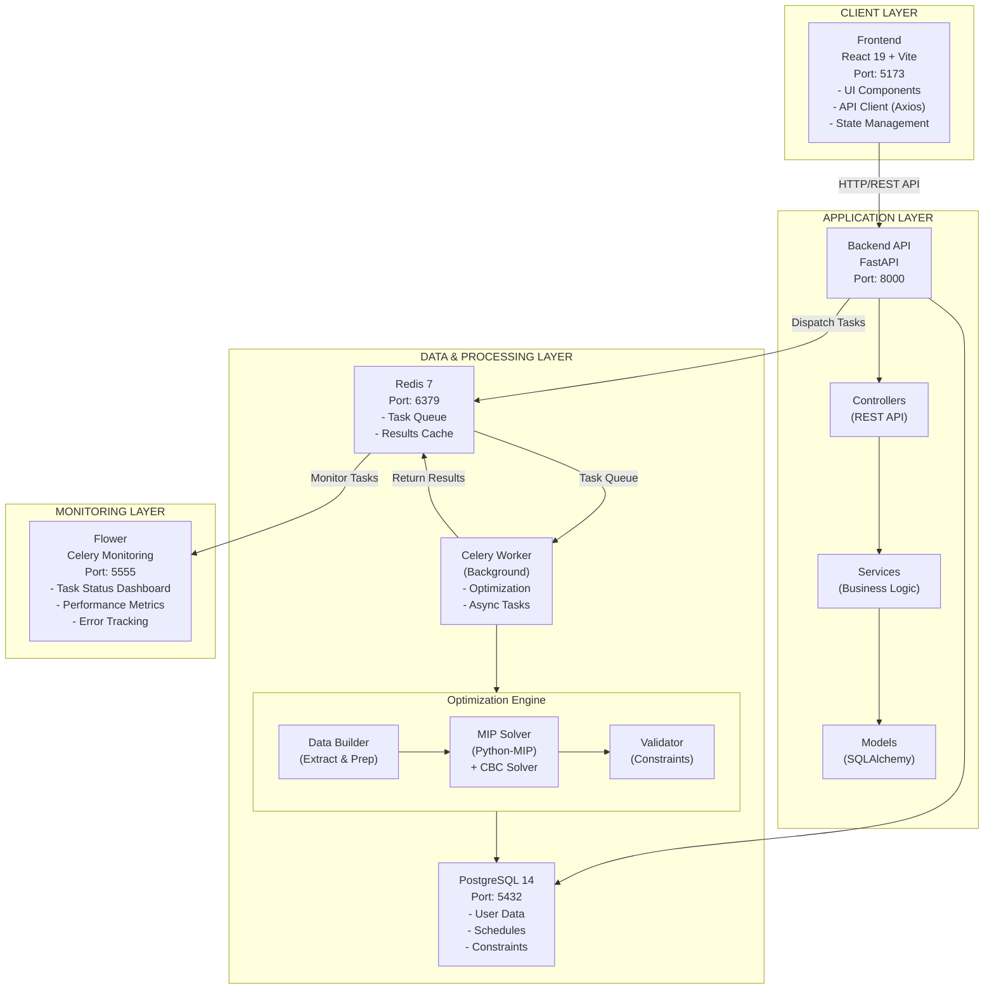
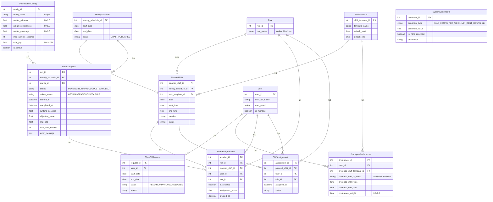
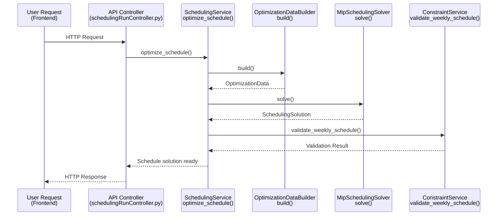
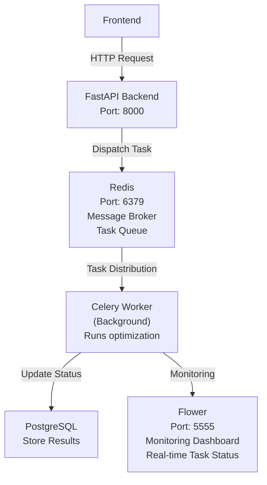
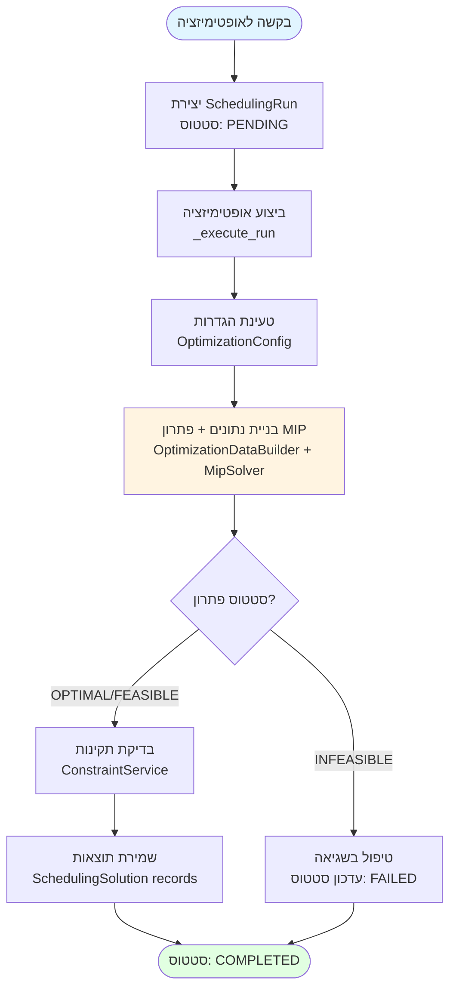
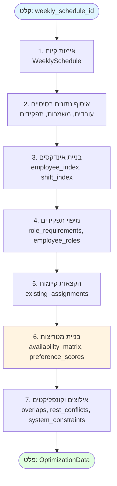

# Smart Scheduling - מערכת אופטימיזציה של משמרות עובדים עם MIP

מערכת אוטומטית ליצירת לוחות זמנים שבועיים באמצעות **Mixed Integer Programming (MIP)**. המערכת מאזנת בין העדפות עובדים, זמינות, כיסוי תפקידים והוגנות בעומס עבודה.

---

## 📑 תוכן עניינים

- [1. מטרות הפרויקט](#1-מטרות-הפרויקט)
- [2. טכנולוגיות מרכזיות](#2-טכנולוגיות-מרכזיות)
- [3. ארכיטקטורת המערכת](#3-ארכיטקטורת-המערכת)
- [4. עיבוד רקע: Celery, Redis ו-Flower](#4-עיבוד-רקע-celery-redis-ו-flower)
- [5. SchedulingService - Orchestrator ראשי](#5-schedulingservice---orchestrator-ראשי)
- [6. בניית מודל האופטימיזציה - OptimizationDataBuilder](#6-בניית-מודל-האופטימיזציה---optimizationdatabuilder)
- [7. מודל MIP: משתני החלטה, אילוצים ופונקציית מטרה](#7-מודל-mip-משתני-החלטה-אילוצים-ופונקציית-מטרה)
  - [7.1 משתני החלטה](#71-משתני-החלטה)
  - [7.2 אילוצים קשים](#72-אילוצים-קשים)
  - [7.3 אילוצים רכים](#73-אילוצים-רכים)
  - [7.4 פונקציית מטרה](#74-פונקציית-מטרה)
- [סיכום](#סיכום)

---

# 1️⃣ מטרות הפרויקט

## 🎯 הבעיה שהמערכת פותרת

| בעיה                         | תיאור                                                      | השפעה                   |
| ---------------------------- | ---------------------------------------------------------- | ----------------------- |
| **📋 ניהול ידני מורכב**      | יצירת לוח זמנים שבועי עם עשרות עובדים, משמרות ותפקידים     | דורש 4-6 שעות עבודה     |
| **⚖️ קונפליקטים ואי-הוגנות** | קושי לאזן בין העדפות עובדים, זמינות, כיסוי תפקידים והוגנות | פתרונות לא מאוזנים      |
| **🔒 אילוצים מורכבים**       | שעות מנוחה, מקסימום שעות, חפיפות, חופשות                   | קושי לעמוד בכל האילוצים |

## 👥 למי מיועדת המערכת

| קהל יעד                  | צרכים                       | יכולות                           |
| ------------------------ | --------------------------- | -------------------------------- |
| **👔 מנהלי משמרות**      | יצירת לוחות זמנים שבועיים   | יצירת אופטימיזציה, צפייה בתוצאות |
| **🏢 מחלקות משאבי אנוש** | ניהול לוחות זמנים של עובדים | הגדרת אילוצים, ניטור הוגנות      |
| **👤 עובדים**            | צפייה במשמרות ועדכון העדפות | צפייה בלוח זמנים, עדכון העדפות   |

## ✅ מדדי הצלחה

| מדד                  | יעד                              | איך נמדד                    |
| -------------------- | -------------------------------- | --------------------------- |
| **⚖️ הוגנות**        | חלוקה מאוזנת של משמרות           | מינימום סטייה מהממוצע       |
| **✅ כיסוי מלא**     | כל משמרת מקבלת את כל התפקידים    | Coverage = 100%             |
| **😊 העדפות עובדים** | מקסימיזציה של שביעות רצון        | מקסימום `preference_scores` |
| **⚡ מהירות**        | הפחתת עבודה ידנית                | מ-4-6 שעות → דקות ספורות    |
| **🎯 איכות פתרון**   | פתרון אופטימלי או קרוב לאופטימלי | MIP gap < 1%                |

---

# 2️⃣ טכנולוגיות מרכזיות

## 🔧 Backend

| טכנולוגיה         | תיאור                                            |
| ----------------- | ------------------------------------------------ |
| **FastAPI**       | Framework מודרני ל-API עם OpenAPI docs אוטומטיים |
| **PostgreSQL 14** | מסד נתונים יחסי                                  |
| **SQLAlchemy**    | ORM לניהול מודלים (15 מודלים)                    |
| **Celery 5.3+**   | עיבוד רקע אסינכרוני                              |
| **Redis 7**       | Message broker עבור Celery                       |

## 🎨 Frontend

| טכנולוגיה    | תיאור               |
| ------------ | ------------------- |
| **React 19** | UI framework מודרני |

## ⚙️ Optimization Engine

| טכנולוגיה                | תיאור                                         |
| ------------------------ | --------------------------------------------- |
| **Python-MIP >= 1.15.0** | ספריית MIP                                    |
| **CBC Solver**           | פתרון MIP open-source (bundled עם Python-MIP) |

## 🐳 Deployment

| טכנולוגיה          | תיאור                      |
| ------------------ | -------------------------- |
| **Docker**         | קונטיינריזציה              |
| **Docker Compose** | אורכיסטרציה של כל השירותים |

**שירותים ב-Docker Compose:**

- `db` (PostgreSQL)
- `backend` (FastAPI)
- `frontend` (React/Vite)
- `redis` (Celery broker)
- `celery-worker` (background tasks)
- `flower` (Celery monitoring)

---

# 3️⃣ ארכיטקטורת המערכת

## 🏗️ High-Level Architecture Diagram



## 🗄️ Infrastructure Components

| רכיב                    | טכנולוגיה        | פורט | תפקיד                    |
| ----------------------- | ---------------- | ---- | ------------------------ |
| **Frontend**            | React 19, Vite   | 5173 | ממשק משתמש               |
| **Backend API**         | FastAPI          | 8000 | REST API, Business Logic |
| **Database**            | PostgreSQL 14    | 5432 | אחסון נתונים             |
| **Message Broker**      | Redis 7          | 6379 | תור משימות Celery        |
| **Background Worker**   | Celery 5.3+      | -    | עיבוד אופטימיזציה        |
| **Monitoring**          | Flower           | 5555 | ניטור משימות Celery      |
| **Optimization Solver** | Python-MIP + CBC | -    | פתרון MIP                |

## 📊 דיאגרמת יישויות (Entity Relationship Diagram)

#### ישויות מורכבות - אופטימיזציה



### 🔑 ישויות מרכזיות - אופטימיזציה

| ישות                    | תפקיד                      | קשרים                                            |
| ----------------------- | -------------------------- | ------------------------------------------------ |
| **SchedulingRun**       | רשומה לכל ריצת אופטימיזציה | מכילה סטטוס, תוצאות פותר, קישור ל-WeeklySchedule |
| **SchedulingSolution**  | הקצאה מוצעת מהפותר         | שלישייה: (user_id, planned_shift_id, role_id)    |
| **OptimizationConfig**  | הגדרות אופטימיזציה         | משקלים (fairness, preferences), פרמטרי פותר      |
| **SystemConstraints**   | אילוצי מערכת               | כל אילוץ: hard/soft, ערך, תיאור                  |
| **TimeOffRequest**      | חופשות מאושרות             | משפיע על מטריצת הזמינות (רק APPROVED)            |
| **EmployeePreferences** | העדפות עובדים              | משפיע על מטריצת העדפות (`preference_scores`)     |

---

## 📦 מודולים מרכזיים - אחריות ותפקידים

| מודול                       | תפקיד                                        | קלט                  | פלט                                    |
| --------------------------- | -------------------------------------------- | -------------------- | -------------------------------------- |
| **SchedulingService**       | Orchestrator ראשי - ניהול תהליך האופטימיזציה | `SchedulingRun`      | `SchedulingSolution`                   |
| **OptimizationDataBuilder** | הכנת נתונים למודל MIP                        | `weekly_schedule_id` | `OptimizationData` (מטריצות, מיפויים)  |
| **MipSchedulingSolver**     | בניית ופתרון מודל MIP                        | `OptimizationData`   | `SchedulingSolution` (הקצאות, מטריקות) |
| **ConstraintService**       | בדיקת תקינות הפתרון                          | `SchedulingSolution` | Validation Result                      |

### 🔄 תפקידים עיקריים

**SchedulingService**:

- ניהול ריצות אופטימיזציה (יצירה, עדכון סטטוס)
- אורכיסטרציה של כל התהליך
- טיפול בשגיאות ו-validation

**OptimizationDataBuilder**:

- איסוף נתונים מ-DB (עובדים, משמרות, תפקידים)
- בניית מטריצות זמינות והעדפות
- זיהוי קונפליקטים ואילוצים

**MipSchedulingSolver**:

- בניית משתני החלטה `x(i,j,r)`
- הוספת אילוצים קשים ורכים
- פתרון מודל MIP עם CBC Solver

**ConstraintService**:

- בדיקת תקינות הפתרון נגד אילוצים קשים
- בדיקות: חפיפות, חופשות, מנוחה, מקסימום שעות

## 🔄 זרימת נתונים (End-to-End)



---

# 4️⃣ עיבוד רקע: Celery, Redis ו-Flower

## 🎯 למה עיבוד רקע?

תהליך האופטימיזציה של לוח זמנים שבועי יכול לקחת **דקות** (תלוי בגודל הבעיה). ביצוע התהליך באופן סינכרוני יגרום ל:

- ⏱️ **Timeout של בקשות HTTP** (בדרך כלל 30-60 שניות)
- 🔒 **חסימת Thread** של FastAPI
- 😞 **חווית משתמש גרועה** - המשתמש מחכה ללא משוב

**הפתרון**: עיבוד אסינכרוני עם **Celery** ו-**Redis**.

## 🏗️ ארכיטקטורה



**הסבר על זרימת העבודה:**

1. **Frontend → Backend**: המשתמש שולח בקשה HTTP
2. **Backend → Redis**:
   - יוצר `SchedulingRun` עם סטטוס `PENDING`
   - שולח משימת Celery ל-Redis
   - מחזיר `task_id` מיד למשתמש (לא מחכה לסיום)
3. **Redis → Celery Worker**: Celery Worker קורא את המשימה מהתור
4. **Celery Worker → PostgreSQL**: מעדכן את הסטטוס ל-`RUNNING`, ואז ל-`COMPLETED` עם התוצאות
5. **Celery Worker → Flower**: Flower מציג את הסטטוס בזמן אמת

## 🔧 רכיבים

#### **Redis** - Message Broker

- **תפקיד**: תור הודעות (Message Queue) בין FastAPI ל-Celery Worker
- **שימוש**:
  - FastAPI שולח משימות ל-Redis
  - Celery Worker קורא משימות מ-Redis
  - Redis שומר תוצאות זמניות
- **פורט**: `6379`

#### **Celery Worker** - עיבוד רקע

- **תפקיד**: ביצוע משימות אופטימיזציה ברקע
- **תהליך**:
  1. קורא משימות מ-Redis
  2. קורא ל-`SchedulingService._execute_optimization_for_run()` (ראה [פרק 5](#5-schedulingservice---orchestrator-ראשי))
  3. מחזיר תוצאה ל-Redis

#### **Flower** - ניטור ומעקב

- **תפקיד**: Dashboard לניטור משימות Celery בזמן אמת
- **יכולות**:
  - 📊 צפייה במשימות פעילות, ממתינות, מושלמות
  - ⏱️ זמני ביצוע וסטטיסטיקות
  - 🔍 מעקב אחר שגיאות
  - 📈 גרפים ומטריקות
- **גישה**: `http://localhost:5555`

### 🔄 זרימת עבודה - שלב אחר שלב

| שלב          | פעולה                                                 | תוצאה                                    |
| ------------ | ----------------------------------------------------- | ---------------------------------------- |
| **1. בקשה**  | Frontend → Backend: `POST /api/scheduling/optimize`   | יצירת `SchedulingRun` עם סטטוס `PENDING` |
| **2. שליחה** | Backend → Redis: שליחת משימת Celery                   | החזרת `task_id` מיד למשתמש               |
| **3. עיבוד** | Redis → Celery Worker: קריאת משימה מהתור              | ביצוע אופטימיזציה ברקע                   |
| **4. עדכון** | Celery Worker → PostgreSQL: עדכון סטטוס               | `RUNNING` → `COMPLETED` + תוצאות         |
| **5. מעקב**  | Frontend: Polling `GET /api/scheduling/runs/{run_id}` | קבלת סטטוס ותוצאות                       |

## ✅ יתרונות

- ⚡ **תגובה מהירה**: API מחזיר מיד (לא מחכה לסיום האופטימיזציה)
- 🔄 **Scalability**: ניתן להוסיף מספר Celery Workers
- 📊 **ניטור**: Flower מספק visibility מלא
- 🛡️ **Resilience**: משימות נשמרות ב-Redis גם אם Worker נופל
- ⏱️ **Timeout Management**: הגבלת זמן אוטומטית למשימות ארוכות

---

# 5️⃣ SchedulingService - Orchestrator ראשי

## 🔨 תפקיד SchedulingService

המודול `SchedulingService` הוא ה-**Orchestrator הראשי** של תהליך האופטימיזציה. הוא מנהל את כל התהליך מקצה לקצה, כולל אינטגרציה עם DB, validation ו-persistence.

**אחריות מרכזית:**

- **ניהול SchedulingRun records** - יצירה, עדכון סטטוס, טיפול בשגיאות
- **אורכיסטרציה של תהליך האופטימיזציה** - קישור בין כל הרכיבים
- **טיפול בשגיאות** - עדכון סטטוס ל-FAILED עם הודעות שגיאה
- **Validation** - בדיקת תקינות הפתרון נגד אילוצים קשים לפני שמירה
- **Persistence** - שמירת תוצאות ב-DB (SchedulingSolution records)

## 📋 תהליך האופטימיזציה - שלבים עיקריים

### 🔄 זרימת העבודה



### 📊 אחריות מרכזיות

| אחריות          | תיאור                             | רכיב                         |
| --------------- | --------------------------------- | ---------------------------- |
| **ניהול ריצות** | יצירה, עדכון סטטוס, טיפול בשגיאות | `SchedulingRun` records      |
| **אורכיסטרציה** | קישור בין כל הרכיבים              | `_execute_run()`             |
| **Validation**  | בדיקת תקינות לפני שמירה           | `ConstraintService`          |
| **Persistence** | שמירת תוצאות ב-DB                 | `SchedulingSolution` records |

#### 2. **`_execute_run()` - Executor משותף**

**תפקיד**: מנהל את כל תהליך האופטימיזציה מקצה לקצה.

**זרימת ביצוע**:

| שלב                 | פעולה                         | תוצאה                                                  |
| ------------------- | ----------------------------- | ------------------------------------------------------ |
| **1. התחלה**        | `_start_run()`                | עדכון סטטוס ל-`RUNNING` (עם הגנה מפני race conditions) |
| **2. הגדרות**       | `_load_optimization_config()` | טעינת משקלים ופרמטרי פותר                              |
| **3. פתרון**        | `_build_and_solve()`          | בניית נתונים + פתרון מודל MIP                          |
| **4. בדיקת תקינות** | בדיקת סטטוס פתרון             | אם `INFEASIBLE` → טיפול בשגיאה                         |
| **5. Validation**   | `_validate_solution()`        | בדיקת תקינות נגד אילוצים קשים                          |
| **6. שמירה**        | `_persist_solution()`         | שמירת תוצאות ב-DB (אופציונלי: הקצאות)                  |

### 🔗 אינטגרציה עם רכיבי המערכת

| שלב              | רכיב                      | תפקיד                        | תוצר                         |
| ---------------- | ------------------------- | ---------------------------- | ---------------------------- |
| **איסוף נתונים** | `OptimizationDataBuilder` | איסוף והכנת נתונים מ-DB      | `OptimizationData`           |
| **פתרון MIP**    | `MipSchedulingSolver`     | בניית ופתרון מודל MIP        | `SchedulingSolution`         |
| **בדיקת תקינות** | `ConstraintService`       | בדיקת פתרון נגד אילוצים קשים | Validation Result            |
| **שמירה**        | `SchedulingPersistence`   | שמירת תוצאות ב-DB            | `SchedulingSolution` records |

### ✅ Validation - בדיקות תקינות

לפני שמירת הפתרון, המערכת בודקת:

- ✅ **חפיפות משמרות** - עובד לא משובץ למשמרות חופפות
- ✅ **חופשות מאושרות** - עובד לא משובץ ב-time off
- ✅ **שעות מנוחה** - מנוחה מינימלית בין משמרות
- ✅ **מקסימום שעות** - לא חריגה ממגבלות שבועיות

> **הערה**: אם יש הפרות → שגיאה (`ValueError`) → סטטוס `FAILED`

---

# 6️⃣ בניית מודל האופטימיזציה - OptimizationDataBuilder

## 🔨 תפקיד OptimizationDataBuilder

המודול `OptimizationDataBuilder` אחראי על איסוף והכנת כל הנתונים הנדרשים לבניית מודל MIP. הוא מתחבר ל-DB, אוסף נתונים, ומכין אותם בפורמט המתאים למודל MIP.

**אחריות מרכזית:**

- **איסוף נתונים מ-DB** - עובדים, משמרות, תפקידים, הקצאות קיימות, חופשות מאושרות
- **בניית מטריצות** - מטריצת זמינות ומטריצת העדפות (NumPy arrays)
- **מיפוי תפקידים** - קישור בין עובדים לתפקידים ובין משמרות לדרישות תפקידים
- **זיהוי קונפליקטים** - חפיפות משמרות, חופשות, שעות מנוחה
- **אילוצי מערכת** - איסוף והכנת אילוצים קשים ורכים
- **בניית אינדקסים** - מיפוי בין IDs לאינדקסים במטריצות

## 📋 תהליך בניית הנתונים

### 🔄 זרימת העבודה - `build()`



### 📊 שלבי הבנייה - פירוט

| שלב               | פעולה                                   | תוצר                                                     |
| ----------------- | --------------------------------------- | -------------------------------------------------------- |
| **1. אימות**      | בדיקת קיום WeeklySchedule               | -                                                        |
| **2. איסוף**      | קריאה מ-DB: עובדים, משמרות, תפקידים     | רשימות בסיסיות                                           |
| **3. אינדקסים**   | מיפוי IDs → אינדקסים                    | `employee_index`, `shift_index`                          |
| **4. תפקידים**    | קישור עובדים ↔ תפקידים, משמרות ↔ דרישות | `role_requirements`, `employee_roles`                    |
| **5. הקצאות**     | איסוף הקצאות קיימות                     | `existing_assignments`                                   |
| **6. מטריצות**    | בניית מטריצת זמינות והעדפות             | `availability_matrix`, `preference_scores`               |
| **7. קונפליקטים** | זיהוי חפיפות, מנוחה, אילוצי מערכת       | `shift_overlaps`, `rest_conflicts`, `system_constraints` |

### 🔑 רכיבי הנתונים המוכנים

#### 1. מיפוי תפקידים

**תפקיד**: קישור בין עובדים לתפקידים ובין משמרות לדרישות.

| מיפוי                   | מבנה                         | תיאור                         |
| ----------------------- | ---------------------------- | ----------------------------- |
| **`role_requirements`** | `{shift_id: [role_id, ...]}` | אילו תפקידים נדרשים לכל משמרת |
| **`employee_roles`**    | `{user_id: [role_id, ...]}`  | אילו תפקידים יש לכל עובד      |

#### 2. הקצאות קיימות

**תפקיד**: איסוף הקצאות שנשמרו במערכת.

- **מבנה**: `{(employee_id, shift_id, role_id)}`
- **שימוש**: הקצאות קיימות לא זמינות להקצאה מחדש → משפיע על מטריצת הזמינות

#### 3. מטריצות - ליבת המודל

**מטריצת הזמינות** (`availability_matrix[i, j]`):

| ערך   | משמעות           | מתי נוצר?             |
| ----- | ---------------- | --------------------- |
| **1** | עובד זמין למשמרת | כל התנאים מתקיימים    |
| **0** | עובד לא זמין     | אם אחד מהתנאים הבאים: |

**תנאים להפיכת זמינות ל-0**:

- ❌ **Time Off מאושר** - עובד עם חופשה בתאריך המשמרת
- ❌ **הקצאה קיימת** - עובד כבר משובץ למשמרת זו
- ❌ **חפיפה** - עובד משובץ למשמרת חופפת
- ❌ **אין תפקיד מתאים** - לעובד אין תפקיד שמתאים לדרישות המשמרת

**מטריצת העדפות** (`preference_scores[i, j]`):

- **טווח**: `0.0` (לא מעדיף) עד `1.0` (מעדיף מאוד)
- **חישוב**: מבוסס על `EmployeePreferences` - יום בשבוע, שעות, תבנית משמרת

#### 4. קונפליקטים ואילוצים

| סוג                        | מבנה                            | תיאור                            |
| -------------------------- | ------------------------------- | -------------------------------- |
| **`shift_overlaps`**       | `{shift_id: [overlapping_ids]}` | משמרות חופפות בזמן               |
| **`shift_rest_conflicts`** | `{shift_id: {conflicting_ids}}` | משמרות שלא מספקות מנוחה מינימלית |
| **`system_constraints`**   | `{Type: (value, is_hard)}`      | אילוצי מערכת (קשים/רכים)         |
| **`shift_durations`**      | `{shift_id: hours}`             | משך כל משמרת בשעות               |

---

# 7️⃣ מודל MIP: משתני החלטה, אילוצים ופונקציית מטרה

## 7.0 Big Picture - מה המודל פותר?

### 🎯 הבעיה המתמטית

המודל **MipSchedulingSolver** פותר בעיית הקצאה אופטימלית:

> **בהינתן**: עובדים, משמרות, תפקידים, העדפות, ואילוצים  
> **מצא**: הקצאות משמרות שממקסמות שביעות רצון, הוגנות וכיסוי  
> **תחת**: אילוצים קשים (חובה) ואילוצים רכים (רצוי)

### 🔄 תהליך הפתרון

```mermaid
flowchart TD
    Start([קלט: נתונים מוכנים<br/>מ-OptimizationDataBuilder]) --> BuildVars[1. בניית משתני החלטה<br/>x(i,j,r) ∈ {0,1}]

    BuildVars --> HardConstraints[2. הוספת אילוצים קשים<br/>כיסוי, חפיפות, מנוחה]
    HardConstraints --> Fairness[3. מודל הוגנות<br/>deviation_pos, deviation_neg]
    Fairness --> SoftConstraints[4. אילוצים רכים<br/>slack variables + penalties]
    SoftConstraints --> Objective[5. פונקציית מטרה<br/>weighted components]

    Objective --> Solve[6. פתרון MIP<br/>CBC Solver]
    Solve --> Check{סטטוס?}

    Check -->|OPTIMAL/FEASIBLE| Extract[7. חילוץ תוצאות<br/>הקצאות + מטריקות]
    Check -->|INFEASIBLE| Error[שגיאה: אין פתרון]

    Extract --> End([פלט: SchedulingSolution])

    style Start fill:#e1f5ff
    style BuildVars fill:#fff4e1
    style Solve fill:#ffe1f5
    style End fill:#e1ffe1
```

### 📊 מבנה המודל - סקירה כללית

| רכיב              | תפקיד                | סוג               |
| ----------------- | -------------------- | ----------------- |
| **משתני החלטה**   | `x(i,j,r)` - הקצאות  | בינאריים {0,1}    |
| **אילוצים קשים**  | כיסוי, חפיפות, מנוחה | חובה לספק         |
| **אילוצים רכים**  | שעות מינ/מקס, משמרות | רצוי עם penalties |
| **הוגנות**        | סטיות מהממוצע        | מינימיזציה        |
| **פונקציית מטרה** | שילוב כל המרכיבים    | מקסימיזציה        |

---

## 7.1 משתני החלטה

### 📐 הגדרה מתמטית

```
x(i,j,r) ∈ {0,1}

כאשר:
  i ∈ [0, n_employees-1]  - אינדקס עובד
  j ∈ [0, n_shifts-1]     - אינדקס משמרת
  r ∈ {role_ids}          - תפקיד (Waiter, Chef, וכו')

x(i,j,r) = 1  ⟺  עובד i מוקצה למשמרת j בתפקיד r
x(i,j,r) = 0  ⟺  אחרת
```

### 💡 אינטואיציה

כל משתנה מייצג החלטה בינארית: **"האם להקצות עובד X למשמרת Y בתפקיד Z?"**

### ✅ תנאי יצירת משתנה

משתנה `x(i,j,r)` נוצר **רק אם** כל התנאים הבאים מתקיימים:

| תנאי            | תיאור                  | איך נבדק                       |
| --------------- | ---------------------- | ------------------------------ |
| **זמינות**      | עובד זמין למשמרת       | `availability_matrix[i,j] = 1` |
| **תפקיד עובד**  | לעובד יש את התפקיד     | `r ∈ employee_roles[i]`        |
| **דרישת משמרת** | המשמרת דורשת את התפקיד | `r ∈ shift_required_roles[j]`  |

> **💡 הערה חשובה**: Time Off מאושר מטופל דרך מטריצת הזמינות - אם לעובד יש time off בתאריך המשמרת, `availability_matrix[i,j] = 0` → לא נוצר משתנה → לא ניתן להקצות.

### 📊 דוגמה קונקרטית

| עובד         | משמרת | תפקיד  | משתנה      | נוצר?                                 |
| ------------ | ----- | ------ | ---------- | ------------------------------------- |
| John (idx=0) | 101   | Waiter | `x(0,0,1)` | ✅ כן - זמין + יש תפקיד + משמרת דורשת |
| John (idx=0) | 101   | Chef   | `x(0,0,3)` | ❌ לא - אין תפקיד Chef                |
| John (idx=0) | 102   | Waiter | `x(0,1,1)` | ❌ לא - time off מאושר                |

---

## 7.2 אילוצים קשים - Feasibility Backbone

### 🎯 תפקיד האילוצים הקשים

אילוצים קשים הם **חובה לספק** - פתרון שלא עומד בהם הוא **לא תקף** (INFEASIBLE).

### 📊 סיווג אילוצים קשים

| קטגוריה           | אילוצים                                            | תכונה                        |
| ----------------- | -------------------------------------------------- | ---------------------------- |
| **כיסוי תפקידים** | Coverage                                           | תמיד קשה - מובנה במערכת      |
| **הגבלות הקצאה**  | Single Role, No Overlap                            | תמיד קשה - מובנה במערכת      |
| **זמינות**        | Time Off                                           | תמיד קשה - דרך מטריצת זמינות |
| **אילוצי מערכת**  | Rest Hours, Max/Min Hours/Shifts, Consecutive Days | ניתן להגדיר כ-קשה או רך      |

---

### ✅ 1. Coverage Constraint (כיסוי תפקידים)

**אינטואיציה**: כל משמרת חייבת לקבל בדיוק את מספר העובדים הנדרש לכל תפקיד.

**נוסחה**:

```
Σ_i x(i,j,r) = required_count[j,r]  ∀ j, r
```

**דוגמה**: משמרת דורשת 2 Waiters + 1 Chef → אילוצים: `x(0,0,1) + x(2,0,1) = 2`, `x(1,0,3) = 1`

---

### 🔒 2. Single Role Per Shift

**אינטואיציה**: עובד לא יכול למלא יותר מתפקיד אחד באותה משמרת.

**נוסחה**:

```
Σ_r x(i,j,r) ≤ 1  ∀ i, j
```

**דוגמה**: John יכול להיות Waiter או Bartender במשמרת 102, אבל לא שניהם.

---

### ⚠️ 3. No Overlapping Shifts

**אינטואיציה**: עובד לא יכול להיות מוקצה למשמרות חופפות בזמן.

**נוסחה**:

```
Σ_r x(i,j1,r) + Σ_r x(i,j2,r) ≤ 1  ∀ i, (j1,j2) חופפים
```

**דוגמה**: משמרת 09:00-17:00 ומשמרת 13:00-22:00 חופפות → עובד לא יכול להיות בשתיהן.

---

### 🏖️ 4. Time Off (Approved)

**אינטואיציה**: עובד עם time off מאושר לא יכול להיות משובץ למשמרות בתאריכי החופשה.

**איך מטופל**: דרך **מטריצת הזמינות** - אם `availability_matrix[i,j] = 0`, לא נוצר משתנה `x(i,j,r)` → לא ניתן להקצות.

> **💡 יתרון**: פחות משתנים = מודל קטן יותר = פתרון מהיר יותר.

---

### ⏰ 5. System Constraints (כאשר מוגדרים כקשים)

אילוצים שניתן להגדיר דרך ה-UI כ**קשים** או **רכים**:

| אילוץ                    | נוסחה                                        | אינטואיציה                |
| ------------------------ | -------------------------------------------- | ------------------------- |
| **MIN_REST_HOURS**       | `Σ_r x(i,j1,r) + Σ_r x(i,j2,r) ≤ 1`          | מנוחה מינימלית בין משמרות |
| **MAX_HOURS_PER_WEEK**   | `Σ_j Σ_r x(i,j,r) * duration(j) ≤ max_hours` | מקסימום שעות שבועי        |
| **MAX_SHIFTS_PER_WEEK**  | `Σ_j Σ_r x(i,j,r) ≤ max_shifts`              | מקסימום משמרות שבועי      |
| **MIN_HOURS_PER_WEEK**   | `Σ_j Σ_r x(i,j,r) * duration(j) ≥ min_hours` | מינימום שעות שבועי        |
| **MIN_SHIFTS_PER_WEEK**  | `Σ_j Σ_r x(i,j,r) ≥ min_shifts`              | מינימום משמרות שבועי      |
| **MAX_CONSECUTIVE_DAYS** | `Σ_d works_on_day[i,d] ≤ max_consecutive`    | מקסימום ימים רצופים       |

> **הערה**: `works_on_day[i, date]` הוא משתנה בינארי עזר שמסמן אם עובד עובד ביום מסוים.

---

## 7.3 אילוצים רכים - Quality vs Feasibility

### 🎯 מושג אילוצים רכים

אילוצים רכים = אילוצים שניתן להפר, אך עם **עונש (penalty)** בפונקציית המטרה.

**מנגנון**:

- **Slack Variables**: משתנים עזר רציפים שמייצגים את הסטייה מהאילוץ
- **Penalty Weight**: משקל גבוה (100.0) כדי להרתיע הפרות, אך לא למנוע אותן

### 📊 סוגי אילוצים רכים

| אילוץ                    | Slack Variable | נוסחה                                        | אינטואיציה       |
| ------------------------ | -------------- | -------------------------------------------- | ---------------- |
| **MIN_HOURS_PER_WEEK**   | `deficit_i`    | `deficit_i ≥ min_hours - total_hours`        | חוסר שעות        |
| **MIN_SHIFTS_PER_WEEK**  | `deficit_i`    | `deficit_i ≥ min_shifts - total_shifts`      | חוסר משמרות      |
| **MAX_HOURS_PER_WEEK**   | `excess_i`     | `excess_i ≥ total_hours - max_hours`         | עודף שעות        |
| **MAX_SHIFTS_PER_WEEK**  | `excess_i`     | `excess_i ≥ total_shifts - max_shifts`       | עודף משמרות      |
| **MIN_REST_HOURS**       | `violation`    | `violation ≥ total_assignments - 1`          | הפרת מנוחה       |
| **MAX_CONSECUTIVE_DAYS** | `excess_days`  | `excess_days ≥ total_days - max_consecutive` | עודף ימים רצופים |

### 💡 דוגמה: MIN_HOURS_PER_WEEK (Soft)

**תרחיש**: MIN_HOURS = 20 שעות, עובד עובד 15 שעות

**חישוב**:

- `deficit_i ≥ 20 - 15 = 5`
- `deficit_i = 5` (עונש של 5 שעות)
- **עונש בפונקציית המטרה**: `-100.0 * 5 = -500`

---

## 7.4 Fairness Modeling - Balancing Employees

### ⚖️ מטרה

למזער את הסטייה המוחלטת של כל עובד מהממוצע → הוגנות גבוהה יותר.

### 📐 מודל סטיות

**למה שני משתנים?** (`deviation_pos` ו-`deviation_neg`):

- אם עובד עובד **יותר** מהממוצע: `emp_total > avg` → `deviation_pos = emp_total - avg`, `deviation_neg = 0`
- אם עובד עובד **פחות** מהממוצע: `emp_total < avg` → `deviation_pos = 0`, `deviation_neg = avg - emp_total`
- אם עובד עובד **בדיוק** הממוצע: `emp_total = avg` → `deviation_pos = 0`, `deviation_neg = 0`

**האילוץ**:

```
emp_total_i - avg_assignments = deviation_pos_i - deviation_neg_i
```

מבטיח ש-`deviation_pos - deviation_neg` שווה בדיוק לסטייה מהממוצע (חיובית או שלילית).

**מינימיזציה בפונקציית המטרה**:

```
- weight_fairness * Σ_i (deviation_pos_i + deviation_neg_i)
```

זה מייצג את **הסטייה המוחלטת** מהממוצע. ככל שהערך קטן יותר, כל העובדים קרובים יותר לממוצע → הוגנות גבוהה יותר.

### 📊 דוגמה

- 3 עובדים, סך דרישות: 15 משמרות → ממוצע = 5 משמרות
- John: 7 משמרות → `deviation_pos = 2`, `deviation_neg = 0`
- Jane: 4 משמרות → `deviation_pos = 0`, `deviation_neg = 1`
- Bob: 4 משמרות → `deviation_pos = 0`, `deviation_neg = 1`
- **סטייה מוחלטת**: `2 + 0 + 1 + 1 = 4`
- **מטרה**: למזער `-weight_fairness * 4`

---

## 7.5 Objective Function - Combining Everything

### 📊 פירוק למרכיבים

פונקציית המטרה משלבת 3 מרכיבים עיקריים:

| מרכיב                 | נוסחה                                         | משקל                 | כיוון              |
| --------------------- | --------------------------------------------- | -------------------- | ------------------ |
| **😊 Preferences**    | `Σ_(i,j,r) preference_scores[i,j] * x(i,j,r)` | `weight_preferences` | מקסימיזציה         |
| **⚖️ Fairness**       | `-Σ_i (deviation_pos_i + deviation_neg_i)`    | `weight_fairness`    | מינימיזציה (מינוס) |
| **⚠️ Soft Penalties** | `-100.0 * soft_penalty_component`             | `100.0` (קבוע)       | מינימיזציה (מינוס) |

### 📐 נוסחה מלאה

```math
maximize:
    objective = (
        weight_preferences * preference_component
        - weight_fairness * fairness_component
        - 100.0 * soft_penalty_component
    )
```

### 🎯 אינטואיציה

- **Preferences**: מקסימיזציה של שביעות רצון עובדים
- **Fairness**: מינימיזציה של אי-הוגנות (סטיות מהממוצע)
- **Soft Penalties**: מינימיזציה של הפרות אילוצים רכים (משקל גבוה להרתיע)

---

## 📎 נספח: קוד מימוש

> **הערה**: קוד המימוש המלא זמין בקובץ `backend/app/services/scheduling/mip_solver.py`

### דוגמה: יצירת משתני החלטה

```python
def _build_decision_variables(model, data, n_employees, n_shifts):
    x = {}  # {(emp_idx, shift_idx, role_id): var}

    for emp_idx, emp in enumerate(data.employees):
        for shift_idx, shift in enumerate(data.shifts):
            if data.availability_matrix[emp_idx, shift_idx] != 1:
                continue  # Skip if employee not available

            required_roles = shift.get('required_roles') or []
            emp_role_ids = set(emp.get('roles') or [])

            for role_req in required_roles:
                role_id = role_req['role_id']
                if role_id in emp_role_ids:
                    var = model.add_var(var_type=mip.BINARY,
                                      name=f'x_{emp_idx}_{shift_idx}_{role_id}')
                    x[emp_idx, shift_idx, role_id] = var

    return x
```

### דוגמה: אילוץ כיסוי

```python
def _add_coverage_constraints(model, data, x, n_employees, n_shifts):
    for shift_idx, shift in enumerate(data.shifts):
        required_roles = shift.get('required_roles') or []

        for role_req in required_roles:
            role_id = role_req['role_id']
            required_count = int(role_req['required_count'])

            eligible_vars = [x[emp_idx, shift_idx, role_id]
                           for emp_idx in range(n_employees)
                           if (emp_idx, shift_idx, role_id) in x]

            if eligible_vars:
                model += mip.xsum(eligible_vars) == required_count
```

---

# 📊 סיכום

מערכת **Smart Scheduling** מציגה פתרון מלא לאופטימיזציה של משמרות עובדים באמצעות **Mixed Integer Programming (MIP)**. המערכת משלבת:

## 🎯 יכולות מרכזיות

- **📐 מודל MIP מדויק** עם משתנים `x(i,j,r)` ותמיכה בתפקידים מרובים
- **🔒 אילוצים קשים ורכים** עם penalties ו-fairness
- **🏗️ ארכיטקטורה נקייה** עם הפרדת אחריות (Controllers → Services → Models)
- **⚡ Background processing** עם Celery, Redis ו-Flower
- **✅ Validation מלא** לפני החזרת הפתרון

## 🚀 טכנולוגיות

| שכבה                 | טכנולוגיות                      |
| -------------------- | ------------------------------- |
| **Frontend**         | React 19, Vite, TailwindCSS     |
| **Backend**          | FastAPI, SQLAlchemy, PostgreSQL |
| **Optimization**     | Python-MIP, CBC Solver          |
| **Background Tasks** | Celery, Redis, Flower           |
| **Deployment**       | Docker, Docker Compose          |

## 📈 תוצאות

- ⚡ **מהירות**: מ-4-6 שעות עבודה ידנית → דקות ספורות
- ⚖️ **הוגנות**: חלוקה מאוזנת של משמרות (מינימום סטייה מהממוצע)
- ✅ **כיסוי מלא**: 100% כיסוי תפקידים בכל משמרת
- 😊 **שביעות רצון**: מקסימיזציה של העדפות עובדים
- 🎯 **איכות פתרון**: פתרון אופטימלי או קרוב לאופטימלי (MIP gap < 1%)
