```mermaid
graph TB
    subgraph Frontend["🖥️ Frontend Layer"]
        React["React 19 App"]
        Routes["React Router"]
        State["State Management"]
    end
    
    subgraph API["🔗 API Layer"]
        FastAPI["FastAPI Server"]
        Auth["JWT Authentication"]
        Validation["Pydantic Validation"]
    end
    
    subgraph Services["⚙️ Service Layer"]
        OptService["SchedulingService"]
        DataBuilder["OptimizationDataBuilder"]
        MIPSolver["MipSchedulingSolver"]
    end
    
    subgraph Async["📦 Async Processing"]
        Celery["Celery Workers"]
        Redis["Redis Broker"]
        Flower["Flower UI"]
    end
    
    subgraph Database["💾 Data Layer"]
        Postgres["PostgreSQL"]
        Models["SQLAlchemy Models"]
    end
    
    subgraph External["🔧 External"]
        CBC["CBC Solver Engine"]
        Numpy["NumPy"]
    end
    
    React --> Routes
    Routes --> FastAPI
    FastAPI --> Auth
    FastAPI --> Validation
    Validation --> OptService
    OptService --> DataBuilder
    DataBuilder --> MIPSolver
    FastAPI --> Celery
    Celery --> Redis
    Redis --> Flower
    OptService --> Postgres
    Postgres --> Models
    MIPSolver --> CBC
    DataBuilder --> Numpy
    
    style Frontend fill:#e1f5ff
    style API fill:#fff3e0
    style Services fill:#f3e5f5
    style Async fill:#e8f5e9
    style Database fill:#fce4ec
    style External fill:#f1f8e9
```

```mermaid
graph TD
    Start["📥 Start Optimization"] --> GetData["Get Employees, Shifts, Preferences"]
    
    GetData --> Validate["Validate Input Data"]
    Validate --> BuildMatrix["Build Preference & Availability Matrices"]
    
    BuildMatrix --> CreateModel["Create MIP Model<br/>Sense: MAXIMIZE"]
    
    CreateModel --> DecisionVars["Create Decision Variables<br/>x[i,j,r] ∈ {0,1}"]
    
    DecisionVars --> CoverageConstr["Add Coverage Constraints<br/>Each shift must have required roles"]
    
    CoverageConstr --> SingleRoleConstr["Add Single-Role Constraints<br/>One role per employee per shift"]
    
    SingleRoleConstr --> OverlapConstr["Add Overlap Constraints<br/>No overlapping shifts"]
    
    OverlapConstr --> HardConstr["Add HARD Constraints<br/>MAX_SHIFTS, MAX_HOURS, MIN_REST"]
    
    HardConstr --> FairnessTerms["Add Fairness Terms<br/>Minimize deviation from average"]
    
    FairnessTerms --> SoftPenalties["Add Soft Penalties<br/>MIN_HOURS, MIN_SHIFTS"]
    
    SoftPenalties --> BuildObj["Build Objective Function<br/>Preferences + Fairness + Coverage - Penalties"]
    
    BuildObj --> Optimize["🔄 CBC Solver Optimizes<br/>Max runtime: configurable"]
    
    Optimize --> CheckStatus["Check Solver Status"]
    
    CheckStatus -->|OPTIMAL or FEASIBLE| Extract["✅ Extract Assignments<br/>Read x[i,j,r] values"]
    CheckStatus -->|INFEASIBLE| Error["❌ No solution found"]
    
    Extract --> CalcMetrics["Calculate Metrics<br/>Preference scores, fairness, coverage"]
    
    CalcMetrics --> Store["💾 Store Results in DB<br/>SchedulingSolution table"]
    
    Store --> End["📤 Return to User"]
    
    Error --> End
    
    style Start fill:#4caf50,color:#fff
    style Optimize fill:#ff9800,color:#fff
    style Extract fill:#4caf50,color:#fff
    style Error fill:#f44336,color:#fff
    style End fill:#4caf50,color:#fff
```

# Smart Scheduling System - Technical Presentation

**Date:** January 17, 2026  
**Project:** Smart Scheduling - Intelligent Shift Assignment Optimization

---

## 1. FILE DIRECTORY TREE (Complete Project Structure)

```
smart-scheduling/
├── backend/
│   ├── app/
│   │   ├── api/
│   │   │   ├── controllers/
│   │   │   ├── dependencies/
│   │   │   │   ├── __init__.py
│   │   │   │   └── auth.py
│   │   │   └── routes/
│   │   │       ├── activityLogRoutes.py
│   │   │       ├── employeePreferencesRoutes.py
│   │   │       ├── exportRoutes.py
│   │   │       ├── metricsRoutes.py
│   │   │       ├── optimizationConfigRoutes.py
│   │   │       ├── plannedShiftRoutes.py
│   │   │       ├── rolesRoutes.py
│   │   │       ├── schedulePublishingRoutes.py
│   │   │       ├── schedulingRoutes.py
│   │   │       ├── schedulingRunRoutes.py
│   │   │       ├── shiftAssignmentRoutes.py
│   │   │       ├── shiftTemplateRoutes.py
│   │   │       ├── systemConstraintsRoutes.py
│   │   │       ├── timeOffRequestRoutes.py
│   │   │       ├── usersRoutes.py
│   │   │       └── weeklyScheduleRoutes.py
│   │   ├── core/
│   │   │   ├── __init__.py
│   │   │   └── config.py
│   │   ├── db/
│   │   │   ├── session.py
│   │   │   └── models/
│   │   │       ├── __init__.py
│   │   │       ├── activityLogModel.py
│   │   │       ├── employeePreferencesModel.py
│   │   │       ├── optimizationConfigModel.py
│   │   │       ├── plannedShiftModel.py
│   │   │       ├── roleModel.py
│   │   │       ├── schedulingRunModel.py
│   │   │       ├── schedulingSolutionModel.py
│   │   │       ├── shiftAssignmentModel.py
│   │   │       ├── shiftRoleRequirementsTabel.py
│   │   │       ├── shiftTemplateModel.py
│   │   │       ├── systemConstraintsModel.py
│   │   │       ├── timeOffRequestModel.py
│   │   │       ├── userModel.py
│   │   │       ├── userRoleModel.py
│   │   │       └── weeklyScheduleModel.py
│   │   ├── schemas/
│   │   │   ├── __init__.py
│   │   │   ├── activityLogSchema.py
│   │   │   ├── employeePreferencesSchema.py
│   │   │   ├── optimizationConfigSchema.py
│   │   │   ├── plannedShiftSchema.py
│   │   │   ├── roleSchema.py
│   │   │   ├── schedulingRunSchema.py
│   │   │   ├── schedulingSolutionSchema.py
│   │   │   ├── shiftAssignmentSchema.py
│   │   │   ├── shiftTemplateSchema.py
│   │   │   ├── systemConstraintsSchema.py
│   │   │   ├── timeOffRequestSchema.py
│   │   │   ├── userSchema.py
│   │   │   ├── weeklyScheduleSchema.py
│   │   │   └── __init__.py
│   │   ├── services/
│   │   │   ├── __init__.py
│   │   │   ├── constraintService.py
│   │   │   ├── schedulingService.py
│   │   │   ├── optimization_data_services/
│   │   │   │   ├── __init__.py
│   │   │   │   ├── optimization_data.py
│   │   │   │   ├── optimization_data_builder.py
│   │   │   │   └── optimization_precompute.py
│   │   │   ├── scheduling/
│   │   │   │   ├── __init__.py
│   │   │   │   ├── mip_solver.py          [CORE ALGORITHM]
│   │   │   │   ├── persistence.py
│   │   │   │   ├── run_status.py
│   │   │   │   ├── scheduling_service.py
│   │   │   │   ├── metrics.py
│   │   │   │   └── types.py
│   │   │   └── utils/
│   │   │       ├── __init__.py
│   │   │       ├── datetime_utils.py
│   │   │       └── overlap_utils.py
│   │   ├── tasks/
│   │   │   ├── __init__.py
│   │   │   └── optimization_tasks.py      [CELERY TASKS]
│   │   ├── celery_app.py
│   │   └── server.py
│   ├── tests/
│   │   ├── test_api_optimization_config.py
│   │   ├── test_apply_solution.py
│   │   ├── test_constraint_service.py
│   │   ├── test_create_config.py
│   │   ├── test_critical_fixes.py
│   │   ├── test_data_builder.py
│   │   ├── test_mip_solver.py
│   │   ├── test_optimization_tables.py
│   │   ├── test_scheduling_service.py
│   │   └── test_schemas.py
│   ├── requirements.txt
│   ├── seed_comprehensive_data.py
│   └── Dockerfile
├── frontend/
│   ├── src/
│   │   ├── api/
│   │   │   ├── activity.js
│   │   │   ├── constraints.js
│   │   │   ├── metrics.js
│   │   │   ├── optimization.js
│   │   │   ├── optimizationConfig.js
│   │   │   ├── schedule.js
│   │   │   └── timeOff.js
│   │   ├── assets/
│   │   ├── components/
│   │   │   ├── ActivityFeed.jsx
│   │   │   ├── ErrorBoundary.jsx
│   │   │   ├── LoadingSpinner.jsx
│   │   │   ├── OptimizationPanel.jsx
│   │   │   ├── RouteSuspense.jsx
│   │   │   ├── WeeklyScheduleWidget.jsx
│   │   │   ├── feedback/
│   │   │   ├── navigation/
│   │   │   └── ui/
│   │   ├── contexts/
│   │   │   └── LoadingContext.jsx
│   │   ├── layouts/
│   │   │   ├── MainLayout.jsx
│   │   │   └── PageLayout.jsx
│   │   ├── lib/
│   │   │   ├── auth.js
│   │   │   ├── axios.js
│   │   │   └── notifications.js
│   │   ├── pages/
│   │   ├── styles/
│   │   ├── App.jsx
│   │   └── main.jsx
│   ├── public/
│   ├── index.html
│   ├── package.json
│   ├── vite.config.js
│   ├── eslint.config.js
│   ├── Dockerfile
│   └── .DS_Store
├── docker-compose.yml
├── README.md
├── DATABASE_ENTITY_DIAGRAM.md
├── OPTIMIZATION_DATA_SERVICES_SUMMARY.md
├── PRESENTATION_CONTENT.md
├── DEMO_VIDEO_SCRIPT.md
├── AI_VIDEO_GENERATION_PROMPT.md
├── CAPCUT_EDITING_GUIDE.md
├── CODE_REVIEW_SERVICES.md
└── .gitignore
```

---

## 2. CORE LOGIC / ALGORITHM - MIP Solver (mip_solver.py)

### Full Code: Mixed Integer Programming Scheduler

```python
"""
MIP solver for scheduling optimization.

This module contains the MipSchedulingSolver class that builds and solves
the Mixed Integer Programming model for shift assignment optimization.
"""

from typing import Dict, List, Tuple
from datetime import datetime
import mip
import numpy as np

from app.services.optimization_data_services import OptimizationData
from app.db.models.optimizationConfigModel import OptimizationConfigModel
from app.db.models.systemConstraintsModel import SystemConstraintType
from app.services.scheduling.types import SchedulingSolution
from app.services.scheduling.metrics import calculate_metrics
from app.services.scheduling.run_status import map_solver_status


class MipSchedulingSolver:
    """MIP solver for scheduling optimization."""
    
    def solve(
        self,
        data: OptimizationData,
        config: OptimizationConfigModel
    ) -> SchedulingSolution:
        """
        Build and solve the MIP model.
        
        Args:
            data: OptimizationData with employees, shifts, and matrices
            config: OptimizationConfig with weights and solver parameters
        
        Returns:
            SchedulingSolution with results
        """
        solution = SchedulingSolution()
        start_time = datetime.now()
        
        # Create MIP model
        model = mip.Model(sense=mip.MAXIMIZE, solver_name=mip.CBC)
        
        # Set solver parameters
        model.max_seconds = config.max_runtime_seconds
        model.max_mip_gap = config.mip_gap
        
        n_employees = len(data.employees)
        n_shifts = len(data.shifts)
        
        # Validate matrix dimensions
        if data.preference_scores.shape != (n_employees, n_shifts):
            raise ValueError(
                f"Preference scores matrix shape mismatch: expected ({n_employees}, {n_shifts}), "
                f"got {data.preference_scores.shape}"
            )
        if data.availability_matrix.shape != (n_employees, n_shifts):
            raise ValueError(
                f"Availability matrix shape mismatch: expected ({n_employees}, {n_shifts}), "
                f"got {data.availability_matrix.shape}"
            )
        
        # Log system constraints
        print("\n📋 System Constraints:")
        for constraint_type, (value, is_hard) in data.system_constraints.items():
            constraint_type_str = constraint_type.value if hasattr(constraint_type, 'value') else str(constraint_type)
            hard_soft = "HARD" if is_hard else "SOFT"
            print(f"  {constraint_type_str}: {value} ({hard_soft})")
        
        # Build decision variables and index
        print(f"Creating decision variables ({n_employees} employees × {n_shifts} shifts × roles)...")
        x, vars_by_emp_shift = self._build_decision_variables(model, data, n_employees, n_shifts)
        print(f"Created {len(x)} decision variables")
        
        # Add constraints
        self._add_coverage_constraints(model, data, x, n_employees, n_shifts)
        single_role_count = self._add_single_role_constraints(model, x, vars_by_emp_shift, n_employees, n_shifts)
        overlap_count = self._add_overlap_constraints(model, data, x, vars_by_emp_shift, n_employees)
        
        # Log constraint counts before HARD constraints
        print(f"\n📊 Constraint Summary (before HARD constraints):")
        print(f"  Decision variables: {len(x)}")
        print(f"  Coverage constraints: {sum(len(shift.get('required_roles', [])) for shift in data.shifts)}")
        print(f"  Single-role constraints: {single_role_count}")
        print(f"  Overlap constraints: {overlap_count}")
        
        hard_constraint_counts = self._add_hard_constraints(model, data, x, vars_by_emp_shift, n_employees)
        
        total_hard_constraints = sum(hard_constraint_counts.values())
        print(f"\n📊 Total HARD constraints added: {total_hard_constraints}")
        print(f"  - MAX_SHIFTS_PER_WEEK: {hard_constraint_counts['max_shifts']}")
        print(f"  - MAX_HOURS_PER_WEEK: {hard_constraint_counts['max_hours']}")
        print(f"  - MIN_REST_HOURS: {hard_constraint_counts['min_rest']}")
        
        # Build objective function
        assignments_per_employee = self._add_fairness_terms(model, data, x, vars_by_emp_shift, n_employees)
        soft_penalty_component = self._add_soft_penalties(model, data, x, vars_by_emp_shift, n_employees)
        objective = self._build_objective(
            model, data, x, config, assignments_per_employee, soft_penalty_component
        )
        model.objective = objective
        
        print(f"\nSolving MIP model...")
        print(f"  Max runtime: {config.max_runtime_seconds}s")
        print(f"  MIP gap: {config.mip_gap}")
        print(f"  Weights: preferences={config.weight_preferences}, fairness={config.weight_fairness}, coverage={config.weight_coverage}")
        
        # Solve the model
        status = model.optimize()
        
        # Record results
        end_time = datetime.now()
        solution.runtime_seconds = (end_time - start_time).total_seconds()
        solution.status = map_solver_status(status)
        
        print(f"\nSolver finished: {solution.status}")
        print(f"Runtime: {solution.runtime_seconds:.2f}s")
        
        if status in [mip.OptimizationStatus.OPTIMAL, mip.OptimizationStatus.FEASIBLE]:
            solution.objective_value = model.objective_value
            solution.mip_gap = model.gap
            
            print(f"\n✅ Solver found {solution.status} solution")
            print(f"Objective value: {solution.objective_value:.3f}")
            print(f"MIP gap: {solution.mip_gap:.4f}")
            
            # Extract assignments
            solution.assignments = self._extract_assignments(x, data)
            solution.metrics = calculate_metrics(data, solution.assignments)
            
            print(f"Total assignments: {len(solution.assignments)}")
            print(f"Average preference score: {solution.metrics.get('avg_preference_score', 0):.3f}")
            print(f"Assignments per employee: min={solution.metrics.get('min_assignments', 0)}, max={solution.metrics.get('max_assignments', 0)}, avg={solution.metrics.get('avg_assignments', 0):.1f}")
        
        return solution
    
    def _build_decision_variables(
        self,
        model: mip.Model,
        data: OptimizationData,
        n_employees: int,
        n_shifts: int
    ) -> Tuple[Dict, Dict]:
        """
        Build decision variables and index for efficient access.
        
        Returns:
            Tuple of (x dict, vars_by_emp_shift dict)
            - x: {(i, j, role_id): var} mapping
            - vars_by_emp_shift: {(i, j): [var1, var2, ...]} mapping for performance
        """
        x = {}
        vars_by_emp_shift = {}
        
        for i, emp in enumerate(data.employees):
            for j, shift in enumerate(data.shifts):
                if data.availability_matrix[i, j] != 1:
                    continue

                required_roles = shift.get('required_roles') or []
                if not required_roles:
                    continue

                emp_role_ids = set(emp.get('roles') or [])
                
                # Create variable for each role that employee has and shift requires
                for role_req in required_roles:
                    role_id = role_req['role_id']
                    if role_id in emp_role_ids:
                        var = model.add_var(var_type=mip.BINARY, name=f'x_{i}_{j}_{role_id}')
                        x[i, j, role_id] = var
                        
                        # Build index for performance
                        if (i, j) not in vars_by_emp_shift:
                            vars_by_emp_shift[(i, j)] = []
                        vars_by_emp_shift[(i, j)].append(var)
        
        return x, vars_by_emp_shift
    
    def _add_coverage_constraints(
        self,
        model: mip.Model,
        data: OptimizationData,
        x: Dict,
        n_employees: int,
        n_shifts: int
    ) -> None:
        """Add coverage constraints: each shift must be assigned exactly the required employees for each role."""
        print("Adding coverage constraints...")
        for j, shift in enumerate(data.shifts):
            required_roles = shift.get('required_roles') or []
            if not required_roles:
                continue

            for role_req in required_roles:
                role_id = role_req['role_id']
                required_count = int(role_req['required_count'])

                eligible_vars = [x[i, j, role_id] for i in range(n_employees) if (i, j, role_id) in x]

                if not eligible_vars:
                    if required_count > 0:
                        raise ValueError(
                            f"Infeasible coverage: planned_shift_id={shift['planned_shift_id']} "
                            f"requires role_id={role_id} count={required_count}, but no eligible employees exist "
                            f"(availability_matrix=0 or no matching roles)."
                        )
                    continue

                model += mip.xsum(eligible_vars) == required_count, f'coverage_shift_{j}_role_{role_id}'
    
    def _add_single_role_constraints(
        self,
        model: mip.Model,
        x: Dict,
        vars_by_emp_shift: Dict,
        n_employees: int,
        n_shifts: int
    ) -> int:
        """
        Add single-role-per-shift constraints: sum_r x[i,j,r] <= 1.
        
        Returns:
            Number of constraints added
        """
        print("Adding single-role-per-shift constraints...")
        count = 0
        for i in range(n_employees):
            for j in range(n_shifts):
                # Use index for performance
                if (i, j) in vars_by_emp_shift:
                    role_vars = vars_by_emp_shift[(i, j)]
                    if len(role_vars) > 1:
                        model += mip.xsum(role_vars) <= 1, f'single_role_emp_{i}_shift_{j}'
                        count += 1
        
        print(f"Added {count} single-role-per-shift constraints")
        return count
    
    def _add_overlap_constraints(
        self,
        model: mip.Model,
        data: OptimizationData,
        x: Dict,
        vars_by_emp_shift: Dict,
        n_employees: int
    ) -> int:
        """
        Add no-overlap constraints: employees can't be assigned to overlapping shifts.
        
        Returns:
            Number of constraints added
        """
        print("Adding no-overlap constraints...")
        count = 0
        
        for shift_id, overlapping_ids in data.shift_overlaps.items():
            if not overlapping_ids:
                continue
            
            shift_idx = data.shift_index[shift_id]
            
            for overlapping_id in overlapping_ids:
                overlapping_idx = data.shift_index[overlapping_id]
                
                # For each employee, they can't be assigned to both overlapping shifts
                for i in range(n_employees):
                    # Use index for performance
                    vars_shift = vars_by_emp_shift.get((i, shift_idx), [])
                    vars_overlap = vars_by_emp_shift.get((i, overlapping_idx), [])
                    
                    if vars_shift and vars_overlap:
                        # Sum of all assignments to shift_idx + sum of all assignments to overlapping_idx <= 1
                        model += mip.xsum(vars_shift) + mip.xsum(vars_overlap) <= 1, f'no_overlap_emp_{i}_shift_{shift_idx}_{overlapping_idx}'
                        count += 1
        
        print(f"Added {count} no-overlap constraints")
        return count
    
    def _add_hard_constraints(
        self,
        model: mip.Model,
        data: OptimizationData,
        x: Dict,
        vars_by_emp_shift: Dict,
        n_employees: int
    ) -> Dict[str, int]:
        """
        Add HARD system constraints.
        
        Returns:
            Dict with counts: {'max_shifts': int, 'max_hours': int, 'min_rest': int}
        """
        print("\nAdding HARD system constraints...")
        counts = {'max_shifts': 0, 'max_hours': 0, 'min_rest': 0}
        
        # MAX_SHIFTS_PER_WEEK (hard)
        max_shifts_constraint = data.system_constraints.get(SystemConstraintType.MAX_SHIFTS_PER_WEEK)
        if max_shifts_constraint and max_shifts_constraint[1]:  # is_hard
            max_shifts = int(max_shifts_constraint[0])
            for i in range(n_employees):
                # Use index for performance
                emp_vars = []
                for (ei, ej) in vars_by_emp_shift.keys():
                    if ei == i:
                        emp_vars.extend(vars_by_emp_shift[(ei, ej)])
                
                if emp_vars:
                    model += mip.xsum(emp_vars) <= max_shifts, f'max_shifts_emp_{i}'
                    counts['max_shifts'] += 1
            print(f"  Added {counts['max_shifts']} MAX_SHIFTS_PER_WEEK constraints (max={max_shifts})")
        
        # MAX_HOURS_PER_WEEK (hard)
        max_hours_constraint = data.system_constraints.get(SystemConstraintType.MAX_HOURS_PER_WEEK)
        if max_hours_constraint and max_hours_constraint[1]:  # is_hard
            max_hours = max_hours_constraint[0]
            for i in range(n_employees):
                # Sum of (x[i,j,r] * shift_duration_hours(j)) for all j, r
                emp_hours_vars = []
                for (ei, ej) in vars_by_emp_shift.keys():
                    if ei == i:
                        shift = data.shifts[ej]
                        shift_id = shift['planned_shift_id']
                        shift_duration = data.shift_durations.get(shift_id, 0.0)
                        if shift_duration > 0:
                            for var in vars_by_emp_shift[(ei, ej)]:
                                emp_hours_vars.append(shift_duration * var)
                
                if emp_hours_vars:
                    model += mip.xsum(emp_hours_vars) <= max_hours, f'max_hours_emp_{i}'
                    counts['max_hours'] += 1
            print(f"  Added {counts['max_hours']} MAX_HOURS_PER_WEEK constraints (max={max_hours})")
        
        # MIN_REST_HOURS (hard) - using rest conflicts
        min_rest_constraint = data.system_constraints.get(SystemConstraintType.MIN_REST_HOURS)
        if min_rest_constraint and min_rest_constraint[1]:  # is_hard
            for shift_id, conflicting_ids in data.shift_rest_conflicts.items():
                if not conflicting_ids:
                    continue
                
                shift_idx = data.shift_index[shift_id]
                
                for conflicting_id in conflicting_ids:
                    conflicting_idx = data.shift_index[conflicting_id]
                    
                    # For each employee, they can't be assigned to both conflicting shifts
                    for i in range(n_employees):
                        # Use index for performance
                        vars_shift = vars_by_emp_shift.get((i, shift_idx), [])
                        vars_conflict = vars_by_emp_shift.get((i, conflicting_idx), [])
                        
                        if vars_shift and vars_conflict:
                            model += mip.xsum(vars_shift) + mip.xsum(vars_conflict) <= 1, f'min_rest_emp_{i}_shift_{shift_idx}_{conflicting_idx}'
                            counts['min_rest'] += 1
            print(f"  Added {counts['min_rest']} MIN_REST_HOURS constraints (min={min_rest_constraint[0]})")
        
        return counts
    
    def _add_fairness_terms(
        self,
        model: mip.Model,
        data: OptimizationData,
        x: Dict,
        vars_by_emp_shift: Dict,
        n_employees: int
    ) -> List:
        """
        Add fairness terms (constraints and auxiliary variables).
        
        Returns:
            List of emp_total expressions for use in objective
        """
        print("\nAdding fairness constraints...")
        
        # Calculate average assignments per employee
        total_required_assignments = sum(
            sum(req['required_count'] for req in shift['required_roles'])
            for shift in data.shifts
            if shift['required_roles']
        )
        
        avg_assignments = total_required_assignments / n_employees if n_employees > 0 else 0
        
        # Build emp_total for every employee (even if they have no variables)
        assignments_per_employee = []
        for i in range(n_employees):
            # Use index for performance
            emp_vars = []
            for (ei, ej) in vars_by_emp_shift.keys():
                if ei == i:
                    emp_vars.extend(vars_by_emp_shift[(ei, ej)])
            
            emp_total = mip.xsum(emp_vars) if emp_vars else 0
            assignments_per_employee.append(emp_total)
        
        return assignments_per_employee
    
    def _add_soft_penalties(
        self,
        model: mip.Model,
        data: OptimizationData,
        x: Dict,
        vars_by_emp_shift: Dict,
        n_employees: int
    ) -> mip.LinExpr:
        """
        Add soft constraint penalties.
        
        Returns:
            LinExpr for soft penalty component
        """
        soft_penalty_component = 0
        
        # MIN_HOURS_PER_WEEK (soft) - penalty for hours below minimum
        min_hours_constraint = data.system_constraints.get(SystemConstraintType.MIN_HOURS_PER_WEEK)
        if min_hours_constraint and not min_hours_constraint[1]:  # is_soft
            min_hours = min_hours_constraint[0]
            for i in range(n_employees):
                # Calculate total hours for this employee using index
                emp_hours_vars = []
                for (ei, ej) in vars_by_emp_shift.keys():
                    if ei == i:
                        shift = data.shifts[ej]
                        shift_id = shift['planned_shift_id']
                        shift_duration = data.shift_durations.get(shift_id, 0.0)
                        if shift_duration > 0:
                            for var in vars_by_emp_shift[(ei, ej)]:
                                emp_hours_vars.append(shift_duration * var)
                
                if emp_hours_vars:
                    total_hours = mip.xsum(emp_hours_vars)
                    # Penalty = max(0, min_hours - total_hours)
                    deficit = model.add_var(var_type=mip.CONTINUOUS, lb=0, name=f'min_hours_deficit_{i}')
                    model += deficit >= min_hours - total_hours
                    soft_penalty_component += deficit
        
        # MIN_SHIFTS_PER_WEEK (soft) - penalty for shifts below minimum
        min_shifts_constraint = data.system_constraints.get(SystemConstraintType.MIN_SHIFTS_PER_WEEK)
        if min_shifts_constraint and not min_shifts_constraint[1]:  # is_soft
            min_shifts = int(min_shifts_constraint[0])
            for i in range(n_employees):
                # Use index for performance
                emp_vars = []
                for (ei, ej) in vars_by_emp_shift.keys():
                    if ei == i:
                        emp_vars.extend(vars_by_emp_shift[(ei, ej)])
                
                if emp_vars:
                    total_shifts = mip.xsum(emp_vars)
                    # Penalty = max(0, min_shifts - total_shifts)
                    deficit = model.add_var(var_type=mip.CONTINUOUS, lb=0, name=f'min_shifts_deficit_{i}')
                    model += deficit >= min_shifts - total_shifts
                    soft_penalty_component += deficit
        
        return soft_penalty_component
    
    def _build_objective(
        self,
        model: mip.Model,
        data: OptimizationData,
        x: Dict,
        config: OptimizationConfigModel,
        assignments_per_employee: List,
        soft_penalty_component: mip.LinExpr
    ) -> mip.LinExpr:
        """
        Build objective function.
        
        Returns:
            LinExpr for the objective
        """
        print("Building objective function...")
        
        # Component 1: Maximize preference satisfaction
        try:
            preference_component = mip.xsum(
                data.preference_scores[i, j] * x[i, j, r]
                for (i, j, r) in x
            )
        except (KeyError, IndexError) as e:
            raise ValueError(
                f"Error building preference component: {e}. "
                f"Matrix shape: {data.preference_scores.shape}, "
                f"Employees: {len(data.employees)}, Shifts: {len(data.shifts)}, "
                f"Variables: {len(x)}"
            ) from e
        
        # Component 2: Fairness (minimize deviation from average)
        # We'll use auxiliary variables for absolute deviation
        fairness_vars = []
        avg_assignments = sum(
            sum(req['required_count'] for req in shift['required_roles'])
            for shift in data.shifts
            if shift['required_roles']
        ) / len(data.employees) if len(data.employees) > 0 else 0
        
        for i, emp_total in enumerate(assignments_per_employee):
            # Deviation from average (can be positive or negative)
            deviation_pos = model.add_var(var_type=mip.CONTINUOUS, lb=0, name=f'dev_pos_{i}')
            deviation_neg = model.add_var(var_type=mip.CONTINUOUS, lb=0, name=f'dev_neg_{i}')
            
            # emp_total - avg = deviation_pos - deviation_neg
            model += emp_total - avg_assignments == deviation_pos - deviation_neg
            
            fairness_vars.append(deviation_pos + deviation_neg)
        
        fairness_component = mip.xsum(fairness_vars) if fairness_vars else 0
        
        # Component 3: Coverage (maximize filled assignments)
        try:
            coverage_component = mip.xsum(x[i, j, r] for (i, j, r) in x)
        except KeyError as e:
            raise ValueError(
                f"Error building coverage component: KeyError {e}. "
                f"This should not happen as we're iterating over x.keys()"
            ) from e
        
        # Component 4: SOFT constraint penalties
        soft_penalty_weight = 100.0  # Large weight to strongly discourage violations
        
        # Combine objectives with weights
        # Note: fairness is minimized, so we subtract it
        # Soft penalties are minimized, so we subtract them
        objective = (
            config.weight_preferences * preference_component +
            config.weight_coverage * coverage_component -
            config.weight_fairness * fairness_component -
            soft_penalty_weight * soft_penalty_component
        )
        
        return objective
    
    def _extract_assignments(self, x: Dict, data: OptimizationData) -> List[Dict]:
        """
        Extract assignments from solved model.
        
        Returns:
            List of assignment dictionaries
        """
        print("\nExtracting assignments...")
        assignments = []
        for (i, j, role_id), var in x.items():
            if var.x > 0.5:  # Variable is 1 (assigned)
                emp = data.employees[i]
                shift = data.shifts[j]
                
                assignments.append({
                    'user_id': emp['user_id'],
                    'planned_shift_id': shift['planned_shift_id'],
                    'role_id': role_id,
                    'preference_score': float(data.preference_scores[i, j])
                })
        
        return assignments
```

### Algorithm Overview:

**Problem Type:** Mixed Integer Programming (MIP) optimization  
**Solver Engine:** CBC (COIN-OR Branch and Cut)  
**Sense:** Maximization

**Decision Variables:**  
- $x_{i,j,r} \in \{0, 1\}$ for each employee $i$, shift $j$, and role $r$
- Auxiliary variables for fairness and soft constraints

**Objective Function Components:**
1. **Preference Satisfaction:** Maximize $\sum_{i,j,r} \text{preference\_score}_{i,j} \cdot x_{i,j,r}$
2. **Fairness:** Minimize deviation from average assignments per employee
3. **Coverage:** Maximize $\sum_{i,j,r} x_{i,j,r}$
4. **Soft Penalties:** Penalize violations of MIN_HOURS and MIN_SHIFTS

**Constraints:**
- **Coverage:** Each shift must have exactly the required employees per role
- **Single Role per Shift:** No employee can work multiple roles in one shift
- **No Overlaps:** Employees cannot be assigned overlapping shifts
- **HARD Constraints:** MAX_SHIFTS, MAX_HOURS, MIN_REST (must be satisfied)
- **SOFT Constraints:** MIN_HOURS, MIN_SHIFTS (penalized in objective)

---

## 3. CELERY TASK DEFINITION (optimization_tasks.py)

```python
"""
Async optimization tasks using Celery.

This module contains Celery tasks for running long-running optimization jobs
in the background to prevent request timeouts.
"""

from typing import Optional
from datetime import datetime

from app.celery_app import celery_app
from app.db.session import SessionLocal
from app.db.models.schedulingRunModel import SchedulingRunModel, SchedulingRunStatus
from app.services.scheduling.scheduling_service import SchedulingService


@celery_app.task(bind=True, name='app.tasks.optimization_tasks.run_optimization')
def run_optimization_task(
    self,
    run_id: int
):
    """
    Celery task to run schedule optimization asynchronously.
    
    This task updates the SchedulingRun record with RUNNING status,
    calls the SchedulingService to perform optimization, and updates
    the record with results.
    
    Args:
        self: Celery task instance (for updating state)
        run_id: ID of the SchedulingRun record (already created with PENDING status)
    
    Returns:
        Dict with run_id, status, and metrics
    """
    db = SessionLocal()
    
    try:
        # Get the run record
        run = db.query(SchedulingRunModel).filter(
            SchedulingRunModel.run_id == run_id
        ).first()
        
        if not run:
            raise ValueError(f"SchedulingRun {run_id} not found")
        
        # Update state for monitoring
        self.update_state(
            state='RUNNING',
            meta={'status': 'Building optimization model', 'run_id': run_id}
        )
        
        # Create service and run optimization
        # The service handles all the logic: data building, solving, storing results
        scheduling_service = SchedulingService(db)
        
        # This will update the run record internally
        run, solution = scheduling_service._execute_optimization_for_run(run)
        
        return {
            'run_id': run.run_id,
            'status': run.status.value,
            'solver_status': run.solver_status.value if run.solver_status else None,
            'objective_value': float(run.objective_value) if run.objective_value else None,
            'runtime_seconds': float(run.runtime_seconds) if run.runtime_seconds else None,
            'solutions_count': run.total_assignments or 0,
            'message': 'Optimization completed successfully'
        }
        
    except Exception as e:
        # Update run record with error
        try:
            run = db.query(SchedulingRunModel).filter(
                SchedulingRunModel.run_id == run_id
            ).first()
            
            if run:
                run.status = SchedulingRunStatus.FAILED
                run.completed_at = datetime.now()
                run.error_message = str(e)
                db.commit()
        except:
            pass
        
        # Re-raise the exception so Celery marks the task as failed
        raise
        
    finally:
        db.close()
```

### Celery Configuration:

- **Broker:** Redis (configured in docker-compose.yml)
- **Task Name:** `app.tasks.optimization_tasks.run_optimization`
- **Binding:** Enabled (`bind=True`) to track task state
- **Monitoring:** Via Flower UI (included in docker-compose.yml)

### Workflow:
1. API creates a `SchedulingRun` record with PENDING status
2. Task is queued with the `run_id`
3. Worker picks up task and runs `run_optimization_task()`
4. Task updates state in Redis for real-time UI updates
5. `SchedulingService` builds data, solves MIP, stores results
6. Task completes with status, objective value, and metrics

---

## 4. PYDANTIC MODELS - Input & Output Schemas

### Shift Assignment Input Schema

**File:** [backend/app/schemas/shiftAssignmentSchema.py](backend/app/schemas/shiftAssignmentSchema.py)

```python
"""
Shift assignment schema definitions.

This module defines Pydantic schemas for shift assignment data validation and serialization
in API requests and responses.
"""

from pydantic import BaseModel, Field
from typing import Optional


# ----------- Base Schema -----------
class ShiftAssignmentBase(BaseModel):
    """Base schema for shift assignments with common fields."""
    planned_shift_id: int = Field(..., description="ID of the planned shift", gt=0)
    user_id: int = Field(..., description="ID of the assigned user", gt=0)
    role_id: int = Field(..., description="ID of the role the user plays in this shift", gt=0)


# ----------- Create Schema -----------
class ShiftAssignmentCreate(ShiftAssignmentBase):
    """
    Schema for creating a new shift assignment.
    """
    pass


# ----------- Read Schema -----------
class ShiftAssignmentRead(ShiftAssignmentBase):
    """
    Schema for shift assignment data in API responses.
    Includes extra info about the user and role for convenience.
    """
    assignment_id: int = Field(..., description="Unique shift assignment identifier")
    user_full_name: Optional[str] = Field(
        default=None,
        description="Full name of the assigned user (convenient to include in responses)"
    )
    role_name: Optional[str] = Field(
        default=None,
        description="Name of the role (convenient to include in responses)"
    )

    model_config = {"from_attributes": True}
```

### Scheduling Solution Output Schema

**File:** [backend/app/schemas/schedulingSolutionSchema.py](backend/app/schemas/schedulingSolutionSchema.py)

```python
"""
Scheduling solution schema definitions.

This module contains Pydantic schemas for SchedulingSolution API requests and responses.
"""

from pydantic import BaseModel, Field
from typing import Optional
from datetime import datetime, date, time


class SchedulingSolutionBase(BaseModel):
    """Base schema with common fields for scheduling solution."""
    
    run_id: int = Field(..., description="ID of the scheduling run")
    planned_shift_id: int = Field(..., description="ID of the planned shift")
    user_id: int = Field(..., description="ID of the assigned employee")
    role_id: int = Field(..., description="ID of the assigned role")
    is_selected: bool = Field(default=True, description="Whether assignment was selected")
    assignment_score: Optional[float] = Field(None, description="Score/contribution to objective")


class SchedulingSolutionCreate(SchedulingSolutionBase):
    """
    Schema for creating a new scheduling solution.
    
    Example:
        {
            "run_id": 1,
            "planned_shift_id": 10,
            "user_id": 5,
            "role_id": 2,
            "is_selected": true,
            "assignment_score": 0.85
        }
    """
    pass


class SchedulingSolutionRead(SchedulingSolutionBase):
    """
    Schema for reading scheduling solution data.
    
    Includes all fields plus metadata and related entity names.
    """
    
    solution_id: int = Field(..., description="Solution identifier")
    created_at: datetime = Field(..., description="When solution was created")
    
    # Optional nested data for convenience
    employee_name: Optional[str] = Field(None, description="Employee full name")
    role_name: Optional[str] = Field(None, description="Role name")
    shift_date: Optional[date] = Field(None, description="Shift date")
    shift_start_time: Optional[time] = Field(None, description="Shift start time")
    shift_end_time: Optional[time] = Field(None, description="Shift end time")

    class Config:
        from_attributes = True


class SchedulingSolutionSummary(BaseModel):
    """
    Minimal schema for listing solutions.
    
    Used for solution previews before applying.
    """
    
    solution_id: int
    planned_shift_id: int
    user_id: int
    role_id: int
    employee_name: Optional[str]
    role_name: Optional[str]
    shift_date: Optional[date]
    shift_start_time: Optional[time]
    shift_end_time: Optional[time]
    assignment_score: Optional[float]

    class Config:
        from_attributes = True


class ApplySolutionRequest(BaseModel):
    """
    Schema for applying an optimization solution.
    
    Request body when converting SchedulingSolution records into ShiftAssignments.
    """
    
    overwrite_existing: bool = Field(
        default=False,
        description="Whether to overwrite existing assignments for the same shifts"
    )
    
    only_selected: bool = Field(
        default=True,
        description="Whether to apply only is_selected=true assignments"
    )


class ApplySolutionResponse(BaseModel):
    """
    Schema for apply solution response.
    
    Returns summary of what was created/updated.
    """
    
    assignments_created: int = Field(..., description="Number of new assignments created")
    assignments_skipped: int = Field(..., description="Number skipped (already exist)")
    assignments_overwritten: int = Field(..., description="Number overwritten")
    error_count: int = Field(default=0, description="Number of errors encountered")
    errors: Optional[list[str]] = Field(None, description="List of error messages")
```

---

## 5. TECH STACK

### Backend Dependencies (backend/requirements.txt)

| Library | Version | Purpose |
|---------|---------|---------|
| **fastapi** | Latest | REST API web framework |
| **uvicorn** | Latest | ASGI application server |
| **sqlalchemy** | Latest | ORM for database access |
| **psycopg2-binary** | Latest | PostgreSQL database adapter |
| **pydantic** | Latest | Data validation & serialization |
| **python-dotenv** | Latest | Environment configuration |
| **email-validator** | Latest | Email validation |
| **werkzeug** | Latest | WSGI utilities |
| **python-jose[cryptography]** | Latest | JWT authentication |
| **mip** | ≥1.15.0 | Mixed Integer Programming solver |
| **numpy** | ≥1.24.0 | Numerical computing |
| **celery** | ≥5.3.0 | Distributed task queue |
| **redis** | ≥5.0.0 | Message broker & caching |
| **flower** | ≥2.0.0 | Celery task monitoring UI |

### Frontend Dependencies (frontend/package.json)

| Library | Version | Purpose |
|---------|---------|---------|
| **react** | ^19.1.1 | UI framework |
| **react-dom** | ^19.1.1 | React DOM rendering |
| **react-router-dom** | 6.30.1 | Client-side routing |
| **axios** | ^1.7.7 | HTTP client |
| **date-fns** | ^4.1.0 | Date/time utilities |
| **lucide-react** | ^0.545.0 | Icon library |
| **react-hot-toast** | ^2.6.0 | Toast notifications |
| **tailwindcss** | ^4.1.14 | Utility-first CSS |
| **@tailwindcss/vite** | ^4.1.14 | Tailwind Vite plugin |
| **vite** | ^7.1.7 | Build tool & dev server |
| **eslint** | ^9.36.0 | Linting |

### Infrastructure

- **Database:** PostgreSQL
- **Message Broker:** Redis
- **Container Runtime:** Docker & Docker Compose
- **MIP Solver Engine:** CBC (COIN-OR Branch and Cut)

### Architecture Pattern

- **Backend:** FastAPI + SQLAlchemy + Celery
- **Frontend:** React 19 + Vite + Tailwind CSS
- **Communication:** REST API (JSON over HTTP/HTTPS)
- **Task Queue:** Celery with Redis broker
- **Optimization:** Python-MIP with CBC solver

---

## Summary

This Smart Scheduling system implements a sophisticated MIP-based workforce optimization engine. The core algorithm (`MipSchedulingSolver`) constructs a large-scale integer programming model that simultaneously optimizes for employee preferences, shift coverage, fairness in assignment distribution, and system constraints. The system uses Celery for asynchronous task execution, allowing long-running optimization jobs to run in the background without blocking API requests.

**Key Features:**
- ✅ Multi-objective optimization (preferences, fairness, coverage)
- ✅ Hard and soft constraints
- ✅ Asynchronous optimization via Celery
- ✅ Real-time progress tracking with Flower
- ✅ Complete REST API for all operations
- ✅ Modern React frontend with real-time updates
- ✅ Comprehensive data validation with Pydantic
- ✅ Scalable Docker deployment

---

## DIAGRAMS

### Diagram 1: System Architecture

**Where to paste:** [draw.io](https://draw.io) → File → New → Select "Mermaid" or paste directly



---

### Diagram 2: MIP Optimization Pipeline

**Where to paste:** [draw.io](https://draw.io) → File → New → Select "Mermaid" or paste directly



---

### Diagram 3: Database Entity Relationship Diagram

**Where to paste:** [draw.io](https://draw.io) → File → New → Select "Mermaid" or paste directly

```mermaid
erDiagram
    USER ||--o{ EMPLOYEE_PREFERENCES : has
    USER ||--o{ TIME_OFF_REQUEST : creates
    USER ||--o{ SHIFT_ASSIGNMENT : gets
    USER ||--o{ SCHEDULING_SOLUTION : "assigned in"
    
    USER ||--o{ USER_ROLE : "has"
    ROLE ||--o{ USER_ROLE : "assigned to"
    
    SHIFT_TEMPLATE ||--o{ PLANNED_SHIFT : "generates"
    PLANNED_SHIFT ||--o{ SHIFT_ROLE_REQUIREMENTS : "requires"
    ROLE ||--o{ SHIFT_ROLE_REQUIREMENTS : "needed for"
    
    PLANNED_SHIFT ||--o{ SHIFT_ASSIGNMENT : "assigned in"
    PLANNED_SHIFT ||--o{ SCHEDULING_SOLUTION : "solved by"
    
    SHIFT_ASSIGNMENT }o--|| ROLE : "in role"
    
    SCHEDULING_RUN ||--o{ SCHEDULING_SOLUTION : "produces"
    OPTIMIZATION_CONFIG ||--o{ SCHEDULING_RUN : "uses"
    SYSTEM_CONSTRAINTS ||--o{ SCHEDULING_RUN : "applied in"
    
    ACTIVITY_LOG }o--|| USER : "logs action of"
    ACTIVITY_LOG }o--|| SCHEDULING_RUN : "tracks"
    
    WEEKLY_SCHEDULE ||--o{ PLANNED_SHIFT : "contains"
    
    USER : int user_id PK
    USER : string email
    USER : string full_name
    USER : boolean is_active
    
    ROLE : int role_id PK
    ROLE : string role_name
    ROLE : string description
    
    USER_ROLE : int user_id FK
    USER_ROLE : int role_id FK
    
    EMPLOYEE_PREFERENCES : int pref_id PK
    EMPLOYEE_PREFERENCES : int user_id FK
    EMPLOYEE_PREFERENCES : float preference_score
    EMPLOYEE_PREFERENCES : int shift_id FK
    
    SHIFT_TEMPLATE : int template_id PK
    SHIFT_TEMPLATE : string shift_name
    SHIFT_TEMPLATE : time start_time
    SHIFT_TEMPLATE : time end_time
    
    PLANNED_SHIFT : int planned_shift_id PK
    PLANNED_SHIFT : int template_id FK
    PLANNED_SHIFT : date shift_date
    PLANNED_SHIFT : int week_id FK
    
    SHIFT_ROLE_REQUIREMENTS : int req_id PK
    SHIFT_ROLE_REQUIREMENTS : int planned_shift_id FK
    SHIFT_ROLE_REQUIREMENTS : int role_id FK
    SHIFT_ROLE_REQUIREMENTS : int required_count
    
    SHIFT_ASSIGNMENT : int assignment_id PK
    SHIFT_ASSIGNMENT : int user_id FK
    SHIFT_ASSIGNMENT : int planned_shift_id FK
    SHIFT_ASSIGNMENT : int role_id FK
    SHIFT_ASSIGNMENT : timestamp created_at
    
    SCHEDULING_RUN : int run_id PK
    SCHEDULING_RUN : string status
    SCHEDULING_RUN : float objective_value
    SCHEDULING_RUN : float runtime_seconds
    SCHEDULING_RUN : timestamp created_at
    
    SCHEDULING_SOLUTION : int solution_id PK
    SCHEDULING_SOLUTION : int run_id FK
    SCHEDULING_SOLUTION : int user_id FK
    SCHEDULING_SOLUTION : int planned_shift_id FK
    SCHEDULING_SOLUTION : float assignment_score
    
    OPTIMIZATION_CONFIG : int config_id PK
    OPTIMIZATION_CONFIG : float weight_preferences
    OPTIMIZATION_CONFIG : float weight_fairness
    OPTIMIZATION_CONFIG : float weight_coverage
    OPTIMIZATION_CONFIG : int max_runtime_seconds
    
    SYSTEM_CONSTRAINTS : int constraint_id PK
    SYSTEM_CONSTRAINTS : string constraint_type
    SYSTEM_CONSTRAINTS : float constraint_value
    SYSTEM_CONSTRAINTS : boolean is_hard
    
    TIME_OFF_REQUEST : int request_id PK
    TIME_OFF_REQUEST : int user_id FK
    TIME_OFF_REQUEST : date start_date
    TIME_OFF_REQUEST : date end_date
    
    ACTIVITY_LOG : int log_id PK
    ACTIVITY_LOG : int user_id FK
    ACTIVITY_LOG : string action
    ACTIVITY_LOG : timestamp timestamp
    
    WEEKLY_SCHEDULE : int schedule_id PK
    WEEKLY_SCHEDULE : date week_start
    WEEKLY_SCHEDULE : date week_end
```

---

## How to Use These Diagrams

### **Option 1: Copy-Paste into draw.io (Recommended)**

1. Go to [https://draw.io](https://draw.io)
2. Click **File** → **New**
3. Click **File** → **Import from** → **Mermaid**
4. Copy the entire Mermaid code block (everything between the triple backticks)
5. Paste it into the import dialog
6. Click **Import**
7. The diagram will be created automatically
8. You can now edit, style, and export as PNG/SVG

### **Option 2: Online Mermaid Editor**

1. Go to [https://mermaid.live](https://mermaid.live)
2. Paste the code directly into the editor
3. See live preview on the right
4. Download as PNG/SVG from the menu

### **Option 3: GitHub / Markdown Preview**

- Paste the Mermaid code blocks directly in this `.md` file
- GitHub will automatically render them as diagrams
- Any Markdown editor with Mermaid support will display them

---

## Diagram Export Tips

- **For Presentations:** Export as **PNG** or **SVG**
- **For Editing:** Keep the **Mermaid code** and re-import if needed
- **For Reports:** Use **SVG** for scalability
- **Recommended Resolution:** 1200x800px or higher

These diagrams are now ready to share with your technical consultant! 📊

